# ServiceNow Impact — Client Briefing

**Application overview, business case, architecture, features, prerequisites and activation**

| | |
|---|---|
| **Platform release** | ServiceNow **Australia** |
| **Prepared for** | Client executive sponsors, IT leadership, ServiceNow platform owner, platform administrators and architects |
| **Document type** | Client-ready briefing / pre-read for an Impact enablement workshop |
| **Evidence base** | ServiceNow Australia-release product documentation for Impact (266 Impact topics in the Australia docs set), Impact packages and entitlement documentation, ServiceNow Store installation instructions, and cross-release Impact release notes. Source topics are listed in Appendix E. |
| **Verification note** | Feature names, entitlements and navigation paths in this document were checked against the Australia-release documentation. Anything marked **"verify"** is either inconsistent between ServiceNow topics or entitlement-dependent — confirm against your Impact package and the live ServiceNow Store listing before committing to a plan. |

> **How to use this document.** Sections 1–2 are the executive and architecture narrative. Section 3 is the feature catalogue (one block per capability, structured as what it is → how it works → why it is useful → example → benefit → availability). Section 4 gives twelve worked client scenarios. Sections 5–6 are the business-benefit and comparison material. Sections 7–8 are the administrator and architect implementation sections (prerequisites and exact activation steps). Section 9 covers the first 90 days and the steady-state cadence; Sections 10–11 cover terminology caveats and reference appendices.

---

## 1. Introduction to ServiceNow Impact

### 1.1 What ServiceNow Impact is

**ServiceNow Impact is a premium, subscription-based customer success product** — not a conventional ServiceNow application. ServiceNow describes it as combining *"AI-powered software tools with hands-on expertise that helps organizations maximize the value of their ServiceNow investment."*

Practically, Impact is three things delivered together:

1. **A digital workspace inside your own ServiceNow instance** — the **Impact Store Application**, which is where Impact features are consumed (recommendations, Platform Health, value management, product adoption roadmaps, approvals and access management). ServiceNow states that from the **Yokohama release onward, the Impact Store Application is the exclusive hub for all new innovative Impact features**.
2. **A ServiceNow-hosted expert collaboration space** — the **Impact Delivery Instance (IDI)**, which hosts your Impact Squad, conversations, activity centre, training insights, value reports and full catalogues that are not yet migrated into your instance.
3. **Human expertise and service entitlements** — your **Impact Squad** (Customer Success Manager, and for higher packages a Customer Success Executive, Platform Architect and Support Account Manager), **24×7 support with enhanced response targets**, **Developer Support**, **Accelerators and Initiatives**, **learning credits** and **discounts**.

Impact's stated core functions are to help you: **plan implementation, track product adoption, maintain platform health, resolve platform issues and access expert support.**

### 1.2 Why ServiceNow introduced it

ServiceNow's framing is that Impact *"personalizes your digital transformation journey and accelerates your time-to-value"* by combining proactive guidance, embedded tooling and dedicated expert support.

The market drivers behind the product:

- **The platform outgrew "ticket-based" support.** Customers no longer only ask *"something is broken, please fix it"*. They ask *"are we using what we bought, is our configuration healthy, will our next upgrade be painful, and what should we do next?"* Case-based support was never designed to answer those questions.
- **Value realisation became a board-level question.** Customers must demonstrate ROI on ServiceNow. Impact provides objectives, measurable outcomes, benchmarks and monetised value reports to answer that question with data rather than anecdote.
- **Technical debt accumulated silently.** Thousands of leading-practice checks are now packaged as **HealthScan definitions** and the **Scan Engine**, so quality can be measured continuously instead of being discovered during an upgrade.
- **Expert capacity is scarce.** Impact packages expertise into **Accelerators** and **Initiatives** — fixed-scope, expert-led engagements — so advice arrives as delivery, not as a document.
- **Upgrade fatigue is real.** Upgrade readiness, Proactive Code Check and Real-Time Prevention attack the causes of broken upgrades before the upgrade window opens.

### 1.3 What business problems Impact solves

| Client problem | How Impact addresses it | Where it lives |
|---|---|---|
| "We cannot prove the value of our ServiceNow investment." | Objectives → measurable outcomes → success metrics → trend data → monetised Value Reports with visible assumptions | Value Management, Outcome Insights, Value Reports |
| "We bought modules nobody uses." | Product Adoption Roadmaps, Capability Maps, licence/entitlement visibility, adoption status per product | Product Adoption, Subscriptions |
| "Our instance has hidden technical debt." | HealthScan definitions, Scan Engine findings, Real-Time Prevention, AI code fixes, Proactive Code Check | Platform Health |
| "We only find problems during an upgrade." | Upgrade-readiness scanning, update-set scanning, pre-upgrade checks, Proactive Code Check | Platform Health, Proactive Code Check |
| "Performance problems are discovered by users, not by us." | Instance Observer: off-instance monitoring, performance metrics, alerts, triage, analytics | Instance Observer |
| "We don't know what to do next." | Recommendation engine, Impact Squad advice, Product Adoption Roadmaps, Accelerators | Impact overview, IDI |
| "Our experts are the bottleneck." | Developer Support, Accelerators, Initiatives, learning credits, training insights | Experts & learning |
| "We cannot prove we are improving." | Monthly Health Assessment, health scores by category, technical KPIs with peer comparison | Platform Health, Tech KPIs |

### 1.4 Where Impact fits in the ServiceNow platform

Impact sits **around and above** the ServiceNow AI Platform. It does not replace your existing processes, your change control, or your Now Support entitlement:

| Layer | What it is | Impact's relationship to it |
|---|---|---|
| **Your instances** | Production, Test, Development | Impact Store Application, Scan Engine, data collection jobs and Instance Observer telemetry live here |
| **Sync layer** | Service Bridge | Secure, bi-directional synchronisation between your instance and the IDI |
| **ServiceNow side** | Impact Delivery Instance (IDI) | Impact Squad workspace, Activity Center, value management, catalogues, training insights |
| **Now Support** | Standard case handling and incident management | Unchanged and still used; Impact **adds** enhanced P1/P2 response targets, Developer Support and proactive engagements on top |
| **AI stack** | Now Assist / ServiceNow Otto | Provides AI-assisted outcome summaries, consumption-report summarisation, GenAI-assisted root-cause analysis and AI code fixes |

Two structural facts make this work:

- **Data flows in both directions.** Findings, scans and health data are produced in your instance; squad-created artefacts (outcomes, Product Adoption Roadmaps, Accelerator requests, conversations, attachments) are migrated/synchronised into your instance so your teams see them where they work.
- **Not everything leaves your instance.** Scan Engine findings are explicitly **not transmitted to the Impact Delivery Instance**, and user-experience monitoring and instance scanning both require explicit consent and permission management.

### 1.5 Impact versus normal ServiceNow administration and support

| Dimension | Normal administration & support | ServiceNow Impact |
|---|---|---|
| **Primary tooling** | Instance UI, Now Support portal, assigned support cases | Impact Store Application + Impact Delivery Instance: Platform Health, Instance Observer, Value Management, Product Adoption, Activity Center |
| **Evidence produced** | Case records, known errors, fixes | HealthScan/Health Assessment reports, tech KPI scores, adoption status, outcome trends, monetised value reports, roadmap artefacts |
| **Success measure** | SLA adherence and incident closure | Business outcomes achieved, value realised, platform health trend, adoption and upgrade readiness |
| **Learning** | Documentation and self-serve training | Learning credits, on-demand courses, certifications, contextual learning recommendations aligned to your outcomes |
| **Engineering help** | Break-fix of ServiceNow base functionality | **Developer Support**: named engineers who help troubleshoot your existing customisations (Advanced/Total, or the Managed Support add-on) |
| **Commercial model** | Included with product support entitlements | Paid subscription packages (**Guided**, **Total**, **Integrated Success**) with **Add-on SKUs** and an Accelerator consumption model |

> **Important honesty point for the client:** Impact does **not** replace platform administration. You still need administrators, a change/release process, and your own data governance. Impact supplies the measurement, guidance and expert capacity that make those things faster and safer.

> **Availability restriction (Australia relevance):** ServiceNow documents that "portions of Impact may not be available to users in the FedRAMP, NSC DOD IL5, or Australia IRAP-Protected data centers, to self-hosted users, or in other restricted environments, or to managed service providers (except for their internal use)." If any part of the estate is in a restricted environment (including IRAP-Protected), confirm the exact feature subset with your Impact Squad before design sign-off.

---

## 2. ServiceNow Impact — high-level architecture

### 2.1 How Impact works conceptually

Think of Impact as a **closed-loop value engine** with four repeating movements:

1. **Baseline and instrument** — your instance is connected (Service Bridge), users and roles are provisioned, and data collection begins: Scan Engine definitions and findings, Instance Observer telemetry, Performance Analytics value metrics, and entitlement/subscription data.
2. **Interpret** — ServiceNow turns raw data into meaning: health scores by category, technical KPIs compared to peers, performance anomalies and alerts, adoption status per capability, outcome trend lines against benchmark and goal.
3. **Recommend and act** — the recommendation engine (rule-based plus AI) and your Impact Squad surface **Recommended next steps**: adopt this capability, run this Accelerator, remediate this finding, take this course, target this outcome. Recommendations can be accepted, hidden, or **converted into work items** in Strategic Portfolio Management (SPM) or Collaborative Work Management (CWM) so platform work is governed like any other delivery work.
4. **Measure and re-baseline** — outcome performance flows into **Outcome Insights** and ultimately **Value Reports** (monetised), while Accelerator consumption, case trends and health scores feed periodic reviews. The loop then repeats on the **Foundations → Steady State** cadence of the Impact operating model.

### 2.2 Main components and modules

| Layer | Component | What it is | Where it lives |
|---|---|---|---|
| **Customer instance (consumer)** | **Impact Store Application** | The Impact application installed on your ServiceNow instance; the primary UI for day-to-day Impact use | Your instance: **All → Impact** |
| | Impact Common | Foundational code and data model for the Impact Store Application | Installed as a dependent app |
| | Impact Content | Content/templates: Accelerator descriptions, pre-built PAR templates | Installed as a dependent app |
| | Impact Health | Scan Engine, Real-Time Validation, Analytics Dashboards, Agile integrations, Proposed Fix, Proactive Code Check | Installed as a dependent app |
| | Impact Value Management — `<product>` | Per-product data collection packs (ITSM, ITOM, CSM, HRSD, IRM, SAM, HAM, APM, App Engine, SecOps, SPM) that feed objectives, outcomes and value reporting | Installed conditionally; jobs must be enabled |
| | Instance Observer | Off-instance observability: performance, availability, alerts, triage, analytics, user experience | Off-instance cloud app; entitlement-tiered |
| | Now Assist for Impact / ServiceNow Otto skills | GenAI capabilities (outcome summarisation, consumption-report summarisation, AI code fixes) | Your instance + Now Assist Admin |
| **ServiceNow side (provider)** | **Impact Delivery Instance (IDI)** | The service provider instance: Impact Squad workspace, Activity Center, Training Insights, Value Reports, catalogues, user/role administration | ServiceNow-hosted (`impact.service-now.com`) |
| **Integration** | **Service Bridge** | Core technology enabling secure, real-time, bi-directional data synchronisation between IDI and your instance, using `sendPayload()` and mapped tables | Platform capability + dependent apps |
| **Support** | Now Support + Impact Squad | Case handling, escalations, operational reviews, advisory sessions | Now Support portal + IDI |
| **Governance** | Roles and groups | Impact roles (platform, scan engine, Instance Observer, user-level), Scan Engine groups, development teams | Your instance |

### 2.3 How the moving parts relate

Use this relationship model when explaining Impact to stakeholders:

- **Customer (account)** → owns one or more **ServiceNow instances**, and is entitled to an **Impact package** (Guided / Total / Integrated Success) plus optional **Add-ons**.
- **Instances** → are registered individually (**My SN Instances**) for Scan Engine integrations, and each onboarded instance is connected to the single **Impact Delivery Instance** for that account. Capability Maps are generated **per instance**.
- **Customer stakeholders** → may be organised into **Stakeholder Groups** (for example IT, HR, Finance). A stakeholder group is a customer-defined logical grouping of an account's stakeholders that share objectives; an instance can belong to one or more groups, and Impact personalises the experience per group.
- **Users** → are assigned **Impact roles** (in your instance) and **Impact Delivery Instance roles** (in IDI). The role determines the persona view: executive, platform owner, team lead, developer, partner, administrator.
- **Services (products/capabilities)** → are the ServiceNow applications and capabilities you are entitled to. Impact tracks each as entitled → planned → in use / not yet activated, and maps capabilities to outcomes and to relevant Accelerators.
- **Goals (objectives and outcomes)** → are the business layer: a high-level **business objective** is connected to one or more measurable **business outcomes**, each with a **success metric**, a **reference quarter (baseline)** and a **goal (target)**. Outcomes link to the capabilities that support them and to recommended learning.
- **Impact capabilities** → consume the above: recommendations point to capabilities, courses, Accelerators or actions; Product Adoption Roadmaps sequence capabilities into phases aligned to objectives; Value Reports aggregate outcome performance into monetised value by objective.
- **Expert engagements (Accelerators/Initiatives)** → are the delivery mechanism for advice and remediation; requests come from the customer (or are squad-recommended) and are consumed against package concurrency entitlements.

### 2.4 Architecture and flow diagram — slide-ready description

**Diagram title:** ServiceNow Impact — how it works (Australia release)

**Layout (left → right, four columns, with a feedback loop underneath):**

**Column 1 — "Your estate" (customer side, grey box):**

- Box: **ServiceNow instances** (Production, Test, Development) — ITOM, ITSM, CSM, HRSD, IRM, Security Operations, SAM/HAM, SPM, App Engine
- Inside that box, stacked components:
  - **Impact Store Application** (Impact Common, Impact Content, Impact Health, Value Management data packs) — *All → Impact*
  - **Scan Engine + HealthScan definitions + Real-time prevention**
  - **Performance Analytics data collection jobs** (value metrics)
  - **Users and Roles** (Platform Owner, Impact Admin, Impact App Admin, Developer, Team Lead, Executive, IO Standard/Read Only)
- Side note: **Instance Observer** — off-instance telemetry, entitlement-tiered

**Column 2 — "Secure sync layer" (centre, thin vertical band):**

- Box: **Service Bridge** — inbound/outbound payloads, table-mapped, status must read **Active replication**
- Small labels above/below: Automated registration (preferred) and Manual registration (regulated / GCC)
- Arrow style: **double-headed** arrow between Column 1 and Column 3 to show bi-directional sync

**Column 3 — "ServiceNow side" (blue box):**

- Box: **Impact Delivery Instance (provider)** containing:
  - **Impact Squad** (CSM / CSE / Platform Architect / Support Account Manager)
  - **Activity Center** (conversations, tasks, calendar, files, activity log)
  - **Value management** (objectives, outcomes, value reports)
  - **Catalogues** (Accelerators, Initiatives, Product Adoption Roadmaps, Capabilities Maps, Training Insights)
- Below it, a small box: **Now Support + 24×7 premium support** and **Developer Support**

**Column 4 (right edge) — "Outcomes" (green box):**

- Boxes: **Adoption ↑**, **Platform health ↑**, **Performance risk ↓**, **Value realised ($)**, **Upgrade readiness ↑**

**Bottom band — the closed loop (arrow leftwards across the whole slide):**

- Box: **Foundations → Steady State operating model**: quarterly reviews, health assessments, performance reviews, outcome reviews, roadmap refresh

**Callout bubbles (small, for the presenter):**

- *"Findings stay in your instance — Scan Engine findings are not transmitted to IDI."*
- *"Feature availability depends on package (Guided / Total), Add-ons, roles and installed plugins."*
- *"Impact Store Application is the exclusive hub for new features from Yokohama onward; IDI retains catalogues and squad collaboration."*

**One-line flow statement for the slide subtitle:**

> *Instrument the instance → interpret with scans, telemetry and value data → recommend and act through experts and Accelerators → measure outcomes and value → repeat on a quarterly cadence.*

**Text-based flow (for the written document):**

```mermaid
flowchart LR
  subgraph CUST["Your ServiceNow instance (consumer)"]
    A1["Impact Store Application\nImpact Common / Content / Health"]
    A2["Platform Health\nScan Engine, HealthScan, Real-time prevention, AI fixes"]
    A3["Value data collection\nPerformance Analytics packs per product"]
    A4["Users & Roles\nPlatform Owner, Admin, Developer, Team Lead, Executive"]
    A5["Instance Observer\n(off-instance observability)"]
  end
  subgraph SYNC["Secure sync layer"]
    B1["Service Bridge\n(automated or manual registration)"]
  end
  subgraph SN["Impact Delivery Instance (provider)"]
    C1["Impact Squad\nCSM / CSE / Platform Architect / SAM"]
    C2["Activity Center\nConversations, Tasks, Files, Calendar"]
    C3["Value management\nObjectives, Outcomes, Value Reports"]
    C4["Catalogues\nAccelerators, Initiatives, PARs, Capability Maps, Training"]
  end
  subgraph OUT["Business outcomes"]
    D1["Adoption"]
    D2["Platform health"]
    D3["Performance & availability"]
    D4["Value realised"]
    D5["Upgrade readiness"]
  end
  CUST <--> B1 <--> SN
  SN --> OUT
  OUT -. "Foundations → Steady State cadence (quarterly reviews)" .-> CUST
```

---

## 3. Main features of ServiceNow Impact

Each feature below follows the same structure so it can be lifted directly into client material: **what it is → how it works → why it is useful → example scenario → expected benefit → availability and dependencies**.

> **Availability legend used throughout:** **[ALL]** available across Impact packages, subject to role and app installation · **[GUIDED+]** package-dependent (Guided / Total entitlements differ) · **[TOTAL]** Total package or specific Add-on · **[ADD-ON]** purchased separately · **[REQUIRES IDI]** needs the connection to the Impact Delivery Instance · **[REQUIRES AI]** needs Now Assist / ServiceNow Otto skills activated and entitled.

### 3.1 Impact workspace (Impact Store Application home)

- **What it is.** The Impact home page inside your own instance — the operational cockpit for the Impact program. (Note: ServiceNow renamed "Impact Workspace" to simply "Impact" in the Washington DC release; some older material still uses "Impact Workspace".)
- **How it works.** Navigate to **All → Impact → Overview**. The home page is a role-personalised hub of widgets: **Recommended next steps**, **Learn about Impact**, **Curated for you**, **Your Impact Squad**, **Impact Foundations**, **Work Items**, **Stay updated** and **Impact Delivery Instance**. Recommendations appear as cards; the three latest are shown, with **View full list** for the complete list.
- **Why it is useful.** It converts a subscription into a daily working surface: every persona sees the next best action without hunting through catalogues or email.
- **Example scenario.** A platform owner starts the day on **All → Impact → Overview**, accepts an Accelerator recommendation for upgrade readiness, and converts a CMDB remediation recommendation into a Strategic Portfolio Management demand item.
- **Expected benefit.** Higher utilisation of the Impact entitlement (fewer "unused benefits"), and a single place where platform work is prioritised and evidenced.
- **Availability.** [ALL] · Requires the Impact Store Application installed and Impact roles assigned.

### 3.2 Impact Delivery Instance and Impact Activity Center

- **What it is.** The IDI is the ServiceNow-hosted provider instance where your Impact Squad works and where Impact benefits not yet migrated into your instance are accessed. The **Activity Center** is the consolidated view of activities supporting your day-to-day journey.
- **How it works.** Access is enabled by your Impact Squad (they send the platform owner a specific URL); IDI administrators assign IDI roles. Activity Center consolidates: **Conversations** (ask your squad directly), **All recommendations**, **Tasks**, **Calendar** (meetings, assessments, goals), **Activity log** and **Files**. It also surfaces your **Value Journey** snapshot, Impact feature usage overview and learning credit balance.
- **Why it is useful.** It is the "human layer" of Impact: it keeps expert dialogue, deliverables, evidence and task ownership in one auditable space rather than in inboxes and shared drives.
- **Example scenario.** During an upgrade assessment, the squad posts the plan to **Files**, logs the assessment in **Calendar**, assigns remediation tasks in **Tasks**, and answers design questions in **Conversations**.
- **Expected benefit.** Reduced coordination overhead and faster expert response; artefacts retained for audit and for the next quarterly review.
- **Availability.** [ALL] · Activities shown may differ by subscription level. IDI roles: Impact User, Impact Executive, Impact Platform Owner, Impact Admin, Impact Permissions Authorizer.

### 3.3 Impact Digest and curated resources

- **What it is.** **Impact Digest** is a periodically auto-generated, personalised snapshot of your Impact consumption, curated by ServiceNow Customer Success Managers, combined with product content and Impact content.
- **How it works.** It is generated periodically; curation is based on the topics your squad has opted into plus consumption statistics, and it points back to goals, platform health, product adoption and value realisation.
- **Why it is useful.** Keeps stakeholders informed without meetings, and nudges usage of benefits that are otherwise easy to forget.
- **Example scenario.** A service desk manager receives a Digest highlighting adoption progress on incident deflection and a relevant course recommendation.
- **Expected benefit.** Improved awareness and adoption of entitlements across a wider stakeholder group.
- **Availability.** [ALL] (content varies by package and activity).

### 3.4 Customer, organisation and stakeholder management

- **What it is.** The structures that model who Impact serves: customer account, instances, stakeholder groups, users and roles, subscriptions and entitlements.
- **How it works.**
  - **Stakeholder Groups (Group Views)** let multiple parts of your organisation (for example IT and Finance) define their own objectives and present them to their own leadership. A stakeholder group is a customer-defined logical group of stakeholders who share objectives; it is a subset of (or equal to) a single account and cannot span multiple accounts. An instance can be associated with one or more groups. The home page personalises to the groups relevant to the user, and results can be filtered across groups and instances.
  - **Users and roles** are administered per persona: Impact Store Application roles in your instance, and IDI roles in the Impact Delivery Instance (**Activity Center → Instance registration**, IDI admin functions).
  - **Subscriptions** give one consolidated view of ServiceNow subscriptions, purchased amounts, secondary meters and the capabilities included in each bundle; allocation continues in **Subscription Management** on the instance.
  - **Multi-instance** handling: each instance is connected and configured separately; Capabilities Maps are generated per instance; outcome comparison across instances is supported with the instance filter.
- **Why it is useful.** Large customers rarely have one ServiceNow stakeholder. Group Views prevent "one-size-fits-all" reporting and let each business function own its own value story.
- **Example scenario.** HR and IT each maintain separate objectives and roadmaps; the CIO views a combined filtered report across both groups.
- **Expected benefit.** Better executive engagement, cleaner value attribution per business function, and clearer entitlement visibility (reducing shelf-ware).
- **Availability.** [ALL] for subscriptions and user management; **Group Views** is documented as initially available to limited customers — discuss enablement with your Impact Squad.

### 3.5 Platform Health — health scanning at scale

- **What it is.** The Platform Health pillar continuously assesses your instance against ServiceNow leading practices. It comprises **HealthScan definitions** (the checks), the **Scan Engine** (the runner), **Scan definitions and definition suites**, **findings**, **Real-Time Prevention / Real-Time Validation**, **Analytics Dashboards**, **Proposed Fix** and (for Total) **Proactive Code Check** functionality.
- **How it works.** Scans execute on a schedule or on demand. The Scan Engine supports parallel processing and can be tuned (see `view-modify-scan-engine-properties.md`, `scan-engine-parallel-processing.md`, `scan-engine-platform-owner-dashboard.md`). Findings are produced in your instance and are **not transmitted to the Impact Delivery Instance**. Findings can be reviewed in dashboards per persona (executive, platform owner, team lead, development team) and actioned through remediation work items. Where enabled, **Real-Time Prevention** evaluates changes as they are made rather than after the fact.
- **Why it is useful.** It replaces opinion with evidence about instance quality, and shifts detection earlier — from post-incident to pre-change.
- **Example scenario.** A development team lead uses the **Team Lead dashboard** to see newly introduced findings after a sprint, assigns remediation to the developer, and re-scans to confirm the finding has cleared.
- **Expected benefit.** Lower technical debt, fewer upgrade surprises, measurable health improvement over time.
- **Availability.** [ALL] for core scanning; **custom definitions** are capped for Guided (up to 10) and unlimited for Total (verify against your entitlement); **Proactive Code Check** functionality is Total-oriented and is documented as deprecating from Impact Zurich 6.0.8.

### 3.6 Building and managing scan definitions

- **What it is.** The ability to author your own checks, group them into **definition suites**, and control how scans run.
- **How it works.** Key tasks documented in the Australia release: `create-scan-engine-definitions.md`, `create-scan-engine-definition-suites.md`, `configure-scan-engine-properties.md`, `configure-real-time-scanning-properties.md`, `configure-application-scanning-properties.md`, `configure-exception-reasons-scan-engine.md`, `submitting-exception-reasons-scan-engine.md`, `syncing-exception-reasons.md`, `understand-scan-engine-results-findings.md`, `viewing-scan-results-scan-engine.md`, `initiating-on-demand-scans-scan-engine.md`, `initiate-limited-def-scans.md`, `initiate-update-set-scans.md`, `add-view-scan-engine-related-lists.md` and `assign-users-scan-engine-groups.md`.
- **Why it is useful.** Every platform team has house rules ("no business logic in UI policies", "no direct writes to CMDB from integrations"). Custom definitions turn house rules into continuous, auditable checks.
- **Example scenario.** An architect writes ten custom definitions that encode the client's integration standards, adds them to a suite, and attaches the suite to the pre-upgrade scan.
- **Expected benefit.** Client standards enforced consistently, with evidence, without manual review effort.
- **Availability.** [GUIDED+] — custom definition limits differ by package.

### 3.7 Proactive Code Check

- **What it is.** A scan capability (with a document suite of its own: `proactive-code-check.md`, `proactive-code-check-scan-suite.md`, `review-address-proactive-code-check-findings.md`) that examines custom code for patterns known to cause problems in future releases.
- **How it works.** It runs within the Platform Health/Scan Engine framework and produces findings that are reviewed and remediated like other scan findings.
- **Why it is useful.** Custom code is the single biggest source of upgrade breakage; finding a risky pattern months before an upgrade is far cheaper than finding it in production after one.
- **Example scenario.** Ahead of a planned Xanadu upgrade, the team runs Proactive Code Check, remediates the flagged script includes, and enters the upgrade window with no code-related blockages.
- **Expected benefit.** Predictable upgrades, less emergency remediation, lower regression risk.
- **Availability.** [TOTAL]-oriented; documented as deprecating from Impact Zurich 6.0.8 — confirm current status with your squad before designing it into a roadmap.

### 3.8 Instance Observer — off-instance observability

- **What it is.** A monitoring capability that observes your instance **from outside** it: performance and availability monitoring, alerting, triage, reporting/analytics and user-experience insights. (Docs use both "Instance Observer" and "Instance Observatory" for the same feature.)
- **How it works.** Documented areas include: **core performance**, **application monitoring (APM)**, **database performance**, **ECC queue**, **email performance**, **events**, **host health**, **jobs**, **load balancer**, **node health**, **pools/replica lag**, **schedulers**, **semaphores**, **standby replica lag**, **user info metrics**, **availability**, **cluster details**, **anomalies detection** and **root-cause correlation**. Alerting covers **popular alerts** and **custom alerts**, **anomaly alerts**, **threshold generation**, **RCC alerts** and **Long-pending job alert cards**; alerts can be managed and notifications received via webhook (customer-configured or third-party). Reporting is via **I/O reports**, **analytics**, **performance insights**, and a **customizable dashboard**. User-experience monitoring requires an admin to review and accept **Terms & Conditions** via **Manage Permissions** in the IDI; user IDs are anonymised by default with an opt-in for non-anonymised collection.
- **Why it is useful.** If the instance is slow, the instance's own monitoring may be the first casualty. Off-instance observation keeps visibility during exactly the incidents that matter most, and alerts catch degradation before users report it.
- **Example scenario.** A node health alert fires at 02:00; the on-call engineer uses triage and root-cause correlation to identify a database bottleneck and resolves it before the business day starts.
- **Expected benefit.** Faster detection and mean-time-to-resolution, fewer user-reported performance incidents, and evidence for capacity and performance planning.
- **Availability.** [GUIDED+] — seats, look-back window, alert counts and analytics differ materially by package (Guided ≈ 5 seats / 45-day look-back / 6 alerts vs Total ≈ 10 seats / 6-month look-back / 40 alerts; analytics is Total-only). Instance Observer is **not** available in the ServiceNow mobile app. Verify your exact entitlement.

### 3.9 Value Management — objectives, outcomes and value reports

- **What it is.** The business-value layer: **business objectives** connected to measurable **business outcomes**, each with a success metric, a reference quarter and a goal, tracked through **Outcome Insights** and monetised in **Value Reports**.
- **How it works.** Objectives and outcomes are created and managed in the Impact Delivery Instance (`objectives-and-outcomes-in-impact-delivery-instance.md`, `manage-objectives-and-outcomes_0.md`) and, for the parts that have migrated, in the Impact Store Application. Data collection jobs (per product) populate the metrics that drive outcomes; **Outcome Insights** show whether an outcome is on track against its benchmark and goal and recommend capabilities/learning; **Value Reports** aggregate outcome performance into monetised value with visible assumptions.
- **Why it is useful.** It is the difference between claiming value and demonstrating it. Because each outcome carries a metric, a baseline and a target, the report is auditable and the assumptions are explicit.
- **Example scenario.** The objective "Reduce cost to serve" is linked to outcomes for incident deflection, self-service adoption and mean-time-to-resolve; six months later the Value Report shows the realisation attributable to the ServiceNow program against the agreed baseline.
- **Expected benefit.** Credible ROI reporting to the executive and finance audience, and a defensible basis for continued investment.
- **Availability.** [TOTAL] principally (Value Reports require **at least two years of product data** to be meaningful); objectives/outcomes have a wider footprint — confirm per feature.

### 3.10 Product Adoption Roadmaps and Capability Maps

- **What it is.** **Capability Maps** show what you own and how much of it you use; **Product Adoption Roadmaps (PARs)** sequence capabilities into phased adoption plans aligned to objectives.
- **How it works.** A Capability Map is generated **per instance** from entitlement and usage data and maps capability → product → adoption status. PARs are created and published (`create-and-publish-a-product-adoption-roadmap.md`) with phases, capabilities and target dates; the **capabilities map mapping** (`product-adoption-roadmap-capabilities-map-mapping.md`) ties roadmap items to the map. Pre-built PAR templates ship with **Impact Content**.
- **Why it is useful.** It answers "what should we do next, and in what order?" with a plan grounded in what you actually own, rather than a generic maturity model.
- **Example scenario.** A client owns ITSM Pro, ITOM Discovery and HRSD. The Capability Map shows Discovery is under-adopted; the PAR sequences Discovery expansion before an ITOM event-management phase, and the recommendation engine starts surfacing the matching Accelerator.
- **Expected benefit.** Higher return on existing licence spend, fewer shelf-ware renewals, and a roadmap the business can follow.
- **Availability.** [ALL] for Capability Maps; PAR authoring/publishing depends on role and package.

### 3.11 Recommendations

- **What it is.** The recommendation engine: rule-based and AI-assisted suggestions of the next best action, surfaced in the Impact Store Application and the IDI.
- **How it works.** Recommendations appear on the Impact home page (**Recommended next steps**) and in the IDI (**All recommendations**). Each has a **recommendation details page** (`recommendation-details-page-in-impact-store.md`) explaining rationale and the actions available: adopt a capability, run an Accelerator, take a course, remediate a finding, target an outcome. Recommendations can be **converted into work items** (`creating-work-items-using-recommendations-and-initiatives.md`, `convert-spm-entity-impact-entity-recommendations.md`, `create-spm-work-item-impact-entity.md`) so they enter normal governance, or converted into Impact entities the other way (`using-recommendations-iip-ws.md`).
- **Why it is useful.** It removes the "blank page" problem — most programs stall not because the team disagrees but because nobody is sure what the highest-value next step is.
- **Example scenario.** After a scan reveals unused CMDB health dashboards, the engine recommends the matching Accelerator; the platform owner converts it into an SPM demand and the squad delivers it in the next quarter.
- **Expected benefit.** Faster decisions, better prioritisation, and traceability from recommendation to delivered outcome.
- **Availability.** [ALL]; quality improves as scan, adoption and value data accumulate.

### 3.12 Accelerators and Initiatives

- **What it is.** **Accelerators** are fixed-scope, expert-led engagements delivered by ServiceNow against a catalog; **Initiatives** are multi-Accelerator programs that sequence work towards a larger goal.
- **How it works.** The catalog is shared between the Impact Store Application and the IDI (**All → Impact → Accelerator and Initiatives → Overview**; IDI: **Impact → Initiatives & Accelerators**). You see usage status (overall state, in-progress expert-led count by category, on-demand count) and a list with name, type, engagement type, sub-type, progress state, target completion date and owner. **Accelerator sub-catalogs:** **Architecture**, **Strategy**, **Technical** and **Optimization**. Requests are made from the IDI or the app (`request-accelerator.md`) and are subject to **concurrency** entitlements: **Guided — 1 at a time across the catalog; Total — 7 concurrent** (2 each for Architecture, Strategy and Technical; 1 for Optimization). Add-ons add concurrencies (**Strategic Value +2 Strategy**, **Platform Governance +2 Architecture**, **Platform Optimization +1 Optimization**). **On-demand** accelerators do not have concurrency limits (not available to Guided; verify).
- **Why it is useful.** It converts advisory relationship into delivered artefacts with defined scope — the fastest available route from "we should" to "we did".
- **Example scenario.** A client needs a governed CMDB roadmap; the squad runs the CMDB/CSDM Architecture Accelerator, producing a target model and a phased plan in weeks rather than months.
- **Expected benefit.** Faster time-to-value on specific goals, expert quality without permanent headcount, and predictable consumption of the entitlement.
- **Availability.** [GUIDED+] · Accelerator scheduling is subject to **resource availability and concurrency limits** — plan engagements in advance.

### 3.13 Impact Squad — the human layer

- **What it is.** Your named ServiceNow experts: **Customer Success Manager (CSM)** in all packages, plus **Customer Success Executive (CSE)**, **Platform Architect** and **Support Account Manager (SAM)** in higher packages.
- **How it works.** The squad is reachable through the IDI **Activity Center** (conversations, tasks, calendar, files) and orchestrates onboarding (Impact Kickoff Meeting), the Foundations phase, Periodic Business Reviews, health assessments and Accelerator delivery. Squad access to your instance is **read-only by default, time-boxed (30 days), revocable**, and re-approval is expected quarterly (`hop-access-impact-squad.md`).
- **Why it is useful.** Tooling without expertise produces dashboards nobody acts on. The squad is what turns findings into decisions.
- **Example scenario.** A new platform owner inherits the program mid-year; the CSM runs a re-baseline workshop and rebuilds the roadmaps around the new team's priorities.
- **Expected benefit.** Faster onboarding for new platform leaders, continuity of the value narrative, and an escalation path that is already informed.
- **Availability.** [ALL] with package-dependent seniority and coverage.

### 3.14 Developer Support

- **What it is.** Named ServiceNow engineers who help troubleshoot and improve **your existing customisations** — beyond the break-fix scope of standard support.
- **How it works.** Named individuals are designated per entitlement; access is managed (`manage-developer-support-user-access.md`) and usage is visible in **Developer Support Usage** (`developer-support-usage.md`). Cases are raised through Developer Support (`create-developer-support-case.md`). Guided provides 5 seats; Total provides 10 (verify).
- **Why it is useful.** Most difficult incidents involve custom code that standard support cannot own. Developer Support gives your developers a senior engineer to reason with, not just a case queue.
- **Example scenario.** A custom business rule fails intermittently after month-end; Developer Support helps isolate the race condition and reviews the fix before deployment.
- **Expected benefit.** Reduced mean-time-to-resolve on complex defects, better-quality customisations, and less reliance on external system integrators for diagnosis.
- **Availability.** [GUIDED+] / **[ADD-ON]** · Developer Support does **not** cover net-new implementations or customisations that break after a family upgrade — raise those with Now Support.

### 3.15 Learning, training insights and coaching

- **What it is.** Learning **credits**, on-demand courses, certifications, and **Training Insights** that recommend learning contextually.
- **How it works.** **Training Insights** (`training-insights.md`) show learning credits (remaining, earned, used), allocated/expiring amounts, and learning recommendations. A **contextual learning recommendation** analyses an outcome's performance and its associated capabilities, then recommends the most relevant ServiceNow University courses; a single learning item can address multiple capabilities, and multiple courses can be recommended for one capability. Recommendations also surface in the Impact home page and appear when outcomes are below target. Learning credits expire; **learning insights** show the balance in IDI.
- **Why it is useful.** Adoption fails where skills are missing. Linking a specific course to a specific under-performing outcome makes learning purposeful rather than generic.
- **Example scenario.** An outcome on "reduce MTTR" is below goal; the recommendation engine surfaces the relevant ServiceNow University course for the incident-management team, funded by learning credits.
- **Expected benefit.** Faster capability uplift, higher adoption of delivered features, and measurable use of an entitlement that is otherwise commonly expired unused.
- **Availability.** [ALL] with package-dependent credit amounts.

### 3.16 Subscriptions and entitlement visibility

- **What it is.** A consolidated view of ServiceNow subscriptions, purchased amounts, secondary meters and the capabilities included in each bundle.
- **How it works.** Visible in the Impact Store Application; allocation continues in **Subscription Management** on the instance. It feeds Capability Maps (Licensing Engine).
- **Why it is useful.** Clients frequently do not know precisely which capabilities they already own — which is how shelf-ware accumulates at renewal.
- **Example scenario.** Ahead of renewal, a client discovers that ITOM capabilities were purchased but never activated, and re-plans rather than re-buys.
- **Expected benefit.** Better renewal decisions and demonstrable return on existing spend.
- **Availability.** [ALL].

### 3.17 Consumption reporting — Benefits & Usage

- **What it is.** The **Consumption Report** at **Impact → Impact Benefits & Usage**, showing how the Impact entitlement has actually been consumed.
- **How it works.** Usage is filtered to a selected period (default one year): Accelerators and Initiatives usage (ongoing, completed, not started; in-progress counts by Architecture/Strategy/Technical/Optimization), **company active Now Support cases by priority P1–P4** with links into Now Support, advisory session requests, and (for non-Guided) premium role/advisory sections. **Benefits & Usage** summarises program benefits: Impact Core, Experts on Demand, Platform Health and Monitoring, Learning and Coaching, Premium Technical Support. There are also **IDE consumption report** and **AI-based consumption report summarisation** capabilities.
- **Why it is useful.** Renewal conversations are far easier when you can show exactly what was used and what was left on the table.
- **Example scenario.** At the annual review, the client shows that Accelerator consumption was 80% and identifies learning credits as the under-used benefit to target next year.
- **Expected benefit.** Transparent value accounting, and an evidence base for package right-sizing.
- **Availability.** [ALL] with package-dependent sections.

### 3.18 Technical KPIs and benchmarking

- **What it is.** **Tech KPIs** — standardised technical measurements of your instance, with the ability to compare against peers, and trend lines against benchmark and goal.
- **How it works.** Tech KPI scores are produced from instance data and surfaced in Platform Health reporting. Peer comparison shows how your KPI scores compare to other customers (and, where relevant, industry benchmark comparisons are referenced at the program level). Value Library **Metric / Benchmark / Goal / Trend** chart lines carry a reference quarter and a goal; a multi-instance comparison view compares KPI scores across your own instances. There is **no standalone "benchmarking module"** — benchmarking exists as peer comparison plus the benchmark/goal lines in the Value Library and Tech KPI reporting.
- **Why it is useful.** A number without context is not actionable; "your KPI is 62" is far less useful than "you are below the peer median, and here is the Accelerator that fixes it".
- **Example scenario.** An architect uses peer comparison to justify investment in Discovery, because the KPI shows materially lower coverage than comparable organisations.
- **Expected benefit.** Objective prioritisation and a credible answer to "how good are we?" in board reporting.
- **Availability.** [TOTAL]-oriented for the richest views; base KPI reporting is wider — verify.

### 3.19 Monthly Health Assessment

- **What it is.** A recurring ServiceNow-delivered assessment of your instance's health, driven by the squad.
- **How it works.** Scans are scheduled (`schedule-monthly-health-assessment-scans.md`), the **Health Assessment dashboard** is used to review outcomes (`health-assessment-dashboard.md`, `manage-health-assessment-dashboard.md`), and consent must be captured before ServiceNow resources scan your instance (the Monthly Health Assessment prompts for consent when scheduling). Report delivery is typically around **two weeks** after the assessment.
- **Why it is useful.** It creates a forced, regular, expert-reviewed checkpoint on platform health, independent of incidents.
- **Example scenario.** Each month the client's platform owner receives the assessment, reviews the health score movement by category, and agrees two remediation actions with the squad.
- **Expected benefit.** Continuous improvement rather than episodic clean-ups, with an auditable cadence.
- **Availability.** [GUIDED+] · **ServiceNow is not responsible for implementing or managing the Monthly Health Assessment**; your squad can assist with instance switching and cancellation.

### 3.20 Impact operating model — Foundations and Steady State

- **What it is.** The engagement rhythm that makes the tooling stick: an initial **Foundations** phase followed by a repeating **Steady State**.
- **How it works.** Documented in `impact-operating-model.md`. Foundations is the onboarding/establishment period (roughly the first 90–120 days) covering kickoff, instance connection, roles, initial scans, objectives and roadmaps. Steady State then repeats **monthly operational and health reviews** and **quarterly outcome, support and executive reviews**.
- **Why it is useful.** Impact is a program, not an installation. The cadence is what converts features into outcomes.
- **Example scenario.** Monthly: platform owner + squad review health findings; Quarterly: executive sponsor reviews outcome performance and value realisation, and re-prioritises the roadmap.
- **Expected benefit.** Predictable governance, continuous improvement, and clear executive visibility.
- **Availability.** [ALL].

### 3.21 AI capabilities — Now Assist for Impact and ServiceNow Otto

- **What it is.** GenAI features embedded in Impact. In the Australia release, Now Assist branding for this context moves to **ServiceNow Otto** — the same capabilities under the new name.
- **How it works.** Documented Australia-release AI capabilities include: **GenAI-based consumption report summarisation** (`gen-ai-based-consumption-report-summarization.md`), **AI code fix for Platform Health** (`configure-ai-code-fix-for-platform-health.md`, `batch-remediation-with-ai.md`), **prevent/resolve technical debt with AI** (`prevent-resolve-technical-debt-ai.md`), and activation of Now Assist skills in Now Assist for Impact (`activate-now-assist-skills-in-now-assist-for-impact.md`). AI code fix requires Now Assist for Impact 3.03+, Now Assist for Platform 11.01+, the skill activated, and the system property **`sn_impact_gen_ai.ai_fix.enabled = true`** (default `false`). Role: **`sn_impact_gen_ai.ai_fix_user`**.
- **Why it is useful.** It compresses the two slowest parts of remediation — writing the fix and writing the report.
- **Example scenario.** After a scan produces 40 Proactive Code Check findings of similar pattern, batch remediation with AI proposes fixes for review rather than leaving 40 developer tickets.
- **Expected benefit.** Faster remediation throughput and less summarisation effort for reporting.
- **Availability.** [REQUIRES AI] · Now Assist skills must be entitled and activated; some skills are package-dependent.

### 3.22 Integrations — Jira, Azure DevOps, SPM, CWM, update sets, automation

- **What it is.** Connectors and work-item integrations that let Impact findings and recommendations enter the tools your teams already use.
- **How it works.** Documented options include **Jira** (`configure-jira-integration-options.md`), **Azure DevOps** (`configure-azure-devops-integration-options.md`), **update-set integration** (`update-set-integration.md`, `update-set-scanning-properties2.md`), **user-story integration** (`user-story-integration-properties.md`), **ServiceNow integration options** (`configuring-sn-integration-options.md`), **AES/AEMC integration properties**, **team development scanning properties**, and conversion of recommendations into **SPM** work items or **CWM** tasks. Integration methods include **OAuth 2.0** (`configure-oauth-auth-method.md`, `configure-oauth-auth-method-prod.md`) and **Basic authentication** (`configure-basic-auth-method.md`).
- **Why it is useful.** Remediation only happens if the work lands in the team's backlog. Impact does not ask teams to adopt a new tool to fix findings.
- **Example scenario.** Every High-severity scan finding automatically creates a Jira issue in the correct team's board with the finding context attached.
- **Expected benefit.** Higher remediation completion rates and no dual-tracking of work.
- **Availability.** [ALL] / [GUIDED+] depending on connector — OAuth 2.0 is preferred over Basic authentication.

### 3.23 Storage and platform capacity

- **What it is.** The storage footprint that Impact consumes on your instance and how to plan it.
- **How it works.** Documented in `impact-store-app-storage-estimation.md`: storage grows with usage; **attachments are the biggest driver**; the IDI connection adds additional storage consumption (data migration/sync). Value Management data collection and scan findings also contribute.
- **Why it is useful.** Storage is a real design constraint, especially for clients with fixed instance capacity or regulated data-residency constraints.
- **Example scenario.** A client with tight storage headroom reviews expected consumption before enabling full data migration, and sizes attachment retention accordingly.
- **Expected benefit.** No surprise capacity incidents, and predictable infrastructure planning.
- **Availability.** [ALL].

### 3.24 Security, data governance and domain separation

- **What it is.** The controls and limitations that govern how Impact data is handled.
- **How it works.**
  - **Consent gates:** user-experience monitoring requires Terms & Conditions acceptance via **Manage Permissions**; Monthly Health Assessment prompts for consent when scheduling; requirements are tracked in **Manage Permissions** (`grant-ide-permissions.md`).
  - **Findings stay local:** Scan Engine findings are not transmitted to the IDI.
  - **Squad access** to your instance is read-only, 30-day, revocable, re-approved quarterly.
  - **Data-moving dependent apps** (relevant to security review): the **Service Bridge** stack, **Cloud Storage**, **Licensing Engine** and the **MIF Customer Instance**. Impact Common, Impact Content and Impact Health do **not** move data off-instance.
  - **Domain separation is not supported** for Impact (`impact-domain-separation.md`).
  - **Restricted environments:** portions of Impact are unavailable in FedRAMP, NSC DOD IL5, Australia IRAP-Protected data centres, self-hosted environments, and to MSPs (except internal use).
- **Why it is useful.** These are the questions a security or risk team will ask first; answering them early prevents schedule slip.
- **Example scenario.** A security review identifies the Service Bridge stack and Licensing Engine as the data-egress components and scopes the assessment to those, avoiding a stall on the wider app.
- **Expected benefit.** Faster security approval and no late-stage surprises.
- **Availability.** [ALL] — limitations apply regardless of package.

### 3.25 Partner and managed-service-provider considerations

- **What it is.** How Impact behaves for MSPs and partners.
- **How it works.** Impact documentation notes restrictions for managed service providers (except for their internal use), and there are specific entitlement variants referenced (for example "MSP Dedicated" and "MSP Domain Separated" in the Total entitlement tables). `hop-access-impact-squad.md` describes squad access arrangements.
- **Why it is useful.** Partner-delivered ServiceNow estates have different governance; knowing the constraints up front avoids designing an operating model that cannot be licensed.
- **Example scenario.** An MSP dual-role (internal use + client delivery) confirms with ServiceNow which portions of Impact may be used for client instances.
- **Expected benefit.** Compliant design and no rework at contract time.
- **Availability.** Verify directly with ServiceNow for MSP scenarios.
---

## 4. Client scenarios — twelve worked examples

Each scenario follows **problem → Impact capability → what the client does → measurable outcome**. These are the scenarios most commonly raised in Australian enterprise and government ServiceNow programs; adapt the numbers to your own baseline.

### 4.1 The renewal conversation you cannot support

- **Problem.** At renewal, the CIO asks what value the platform delivered. The team has incident statistics and anecdote, but no monetised business case.
- **Capability.** Value Management (objectives → outcomes → success metrics), Outcome Insights, Value Reports, Tech KPIs.
- **What the client does.** Agree 3–5 business objectives with the executive sponsor (for example "reduce cost to serve", "improve employee experience"). Link each to measurable outcomes with a baseline quarter and a target. Enable the per-product data collection jobs that populate the metrics. Review outcome trends monthly with the squad; publish the annual Value Report.
- **Measurable outcome.** A defensible, assumption-documented ROI statement at renewal — with the honest caveat that a Value Report needs **at least two years of product data** to be meaningful, so start early rather than at renewal time.

### 4.2 Shelf-ware: paying for capability nobody uses

- **Problem.** Licences were purchased for ITOM, HRSD and SecOps, but adoption is patchy. Nobody can state confidently which capabilities are live.
- **Capability.** Subscriptions view, Capability Maps (per instance), Product Adoption Roadmaps, adoption status tracking, recommendations.
- **What the client does.** Review the Capability Map, agree the top five under-adopted capabilities, build a PAR that sequences them against the business calendar, and accept the matching recommendations/Accelerators.
- **Measurable outcome.** Reduced shelf-ware at renewal and a sequenced adoption plan instead of a wish list.

### 4.3 Technical debt discovered too late

- **Problem.** A major upgrade is six weeks away and the team does not know what will break.
- **Capability.** HealthScan definitions, Scan Engine (including update-set scans), Proactive Code Check, Real-Time Prevention, findings dashboards, AI code fixes.
- **What the client does.** Run a full scan, triage findings by severity using the development-team and team-lead dashboards, remediate the top risks, re-scan to confirm, and use AI code fix review for repetitive patterns.
- **Measurable outcome.** An upgrade with materially fewer code-related defects and a documented pre-upgrade health baseline. (Run the first full scan overnight — it can take hours.)

### 4.4 Performance incidents reported by users, not monitoring

- **Problem.** Users report slowness; by the time the platform team investigates, the condition has passed and root cause is guesswork.
- **Capability.** Instance Observer — performance metrics, availability, anomaly detection, alerts, triage, root-cause correlation.
- **What the client does.** Enable Instance Observer, tune alert thresholds (anomaly-based and custom), configure webhook notifications into the existing on-call channel, and adopt the triage workflow.
- **Measurable outcome.** Performance degradation detected before user reports; shorter MTTR because correlation evidence arrives with the alert.

### 4.5 The new platform owner inherits an undocumented program

- **Problem.** The person who led the ServiceNow program leaves. The replacement inherits licences, customisations and conflicting priorities with no context.
- **Capability.** Impact Squad (CSM), Impact home page, Digest, Activity Center, Product Adoption Roadmaps, training insights, learning credits.
- **What the client does.** Run a re-baseline workshop with the squad, review the roadmap and health findings, and fund role-based training from learning credits.
- **Measurable outcome.** Continuity of the value narrative and a documented plan within the first quarter of the new owner's tenure.

### 4.6 Change management is reactive, not preventative

- **Problem.** Every change carries regression risk; testing is manual and incomplete, and bad changes reach production.
- **Capability.** Real-Time Prevention / Real-Time Validation, scan definitions and suites, scan exception reasons, team development scanning.
- **What the client does.** Encode organisational standards as custom scan definitions, enable real-time validation for the highest-risk record types, and route exceptions through an approved exception-reason process.
- **Measurable outcome.** Fewer production incidents attributable to change, with evidence of enforcement rather than policy statements.

### 4.7 Skills gap is the real adoption blocker

- **Problem.** Features are delivered but adoption stalls; teams do not know how to use what was built.
- **Capability.** Training Insights, contextual learning recommendations, learning credits, ServiceNow University courses.
- **What the client does.** Identify the under-performing outcome, accept the contextual learning recommendation, and fund the course from expiring credits before they lapse.
- **Measurable outcome.** Measurable improvement on the linked outcome metric and higher feature adoption.

### 4.8 Remediation work never gets prioritised

- **Problem.** Scans produce good findings, but they sit in a list. No finding converts into funded, scheduled work.
- **Capability.** Recommendation → work-item conversion into **SPM** or **CWM**, integrations to **Jira / Azure DevOps**, Accelerator requests.
- **What the client does.** Route High-severity findings automatically into the team's existing backlog tool with the finding context attached; convert strategic recommendations into SPM demands during quarterly planning.
- **Measurable outcome.** Rising remediation completion rate and no dual-tracking of platform work.

### 4.9 Multiple business units, one platform, competing priorities

- **Problem.** IT, HR and Finance each want to shape the roadmap; a single global report satisfies nobody and gets ignored.
- **Capability.** Stakeholder Groups (Group Views), per-group objectives, instance filtering, cross-group reporting.
- **What the client does.** Define stakeholder groups that align to real accountability boundaries, let each group own objectives and reporting, and give the CIO a filtered combined view.
- **Measurable outcome.** Higher executive engagement and cleaner value attribution per function. (Note: Group Views is documented as initially available to limited customers — confirm enablement with your squad. A group cannot span multiple accounts.)

### 4.10 Controlled environment, constrained feature set

- **Problem.** Part of the estate sits in a restricted environment (for example IRAP-Protected), or the organisation is an MSP, and it is unclear which Impact features may be used.
- **Capability.** Documented availability restrictions, domain-separation limitation, squad guidance.
- **What the client does.** Confirm the exact feature subset with the Impact Squad before design sign-off, and confirm **before** committing to a roadmap that assumes a feature. Note that Impact does not support domain separation.
- **Measurable outcome.** No late-stage design rework caused by an entitlement or environment constraint.

### 4.11 Consumption and entitlement governance

- **Problem.** The organisation pays for Impact but cannot show what was consumed, so the next renewal debate restarts from zero.
- **Capability.** Consumption Report / **Benefits & Usage**, Accelerator usage status, Developer Support usage, learning balance.
- **What the client does.** Review the Consumption Report quarterly with the squad, target the specific under-used benefit (usually learning credits or Accelerator concurrency), and track it like any other KPI.
- **Measurable outcome.** Higher utilisation of the entitlement, and an evidence-based position at renewal.

### 4.12 Regulated onboarding: manual registration

- **Problem.** The organisation's security posture prevents automated cloud registration of instances to a ServiceNow-hosted service.
- **Capability.** Manual (regulated) registration path, Service Bridge, connection verification.
- **What the client does.** Use the mandated manual registration flow from the IDI, complete the validation steps, and confirm the connection reports **Active replication** inbound and outbound. Document which components move data for the security assessment.
- **Measurable outcome.** A compliant, verified connection — necessary for almost every other Impact benefit. (Named contact administrator may differ from the registrant.)

---

## 5. Business benefits

### 5.1 Benefits by stakeholder

| Stakeholder | What they get from Impact | Evidence they can point to |
|---|---|---|
| **CIO / CDIO** | Confidence that the platform is delivering the intended business outcomes; a defensible ROI position | Value Reports, Outcome Insights trends, quarterly executive reviews |
| **CFO / Finance** | Visible return against existing spend; reduced shelf-ware; assumption-transparent monetisation | Value Reports (with assumptions), Subscriptions/Capability Map, Consumption Report |
| **CIO office / Strategy** | Prioritised roadmap aligned to business objectives; recommendations converted into governed work | Product Adoption Roadmaps, SPM/CWM work items, Accelerator outcomes |
| **Platform Owner** | Continuous visibility of platform health and performance; a defined cadence and an expert escalation path | Health scores by category, Instance Observer alerts, Monthly Health Assessment, Tech KPIs |
| **Platform Architect** | Engineering-quality evidence for design decisions; leading-practice checks; upgrade readiness | Scan findings, custom definitions/suites, Proactive Code Check, peer KPI comparison |
| **ITSM / Service Operations Manager** | Fewer user-reported incidents; faster resolution of the hard cases | Instance Observer alert-to-resolution history, Developer Support outcomes, case trends |
| **Developers / development teams** | Specific, actionable findings instead of generic review comments; fast paths to fixes | Team Lead / Development Team dashboards, AI code fix proposals, Jira/ADO integration |
| **Security & Risk** | Documented data flows, consent controls and environment limitations; no unsanctioned egress | Manage Permissions/consent records, data-egress component list, availability restrictions |
| **Change / Release Manager** | Lower change-failure risk and cleaner upgrades | Real-Time Prevention, scan coverage, upgrade-readiness evidence |
| **Learning & Enablement** | Purposeful training linked to outcomes, funded through credits | Training Insights, contextual course recommendations, credit balance |
| **Business unit leaders (HR, Finance, etc.)** | Their own value story, in their language | Stakeholder Groups, per-group objectives and reporting |

### 5.2 Benefits by category

1. **Financial.** Return on existing licence spend, avoidance of unnecessary re-purchase, and monetised value reporting that can be taken to the board.
2. **Risk reduction.** Technical debt measured continuously; upgrade and change risk found before production; performance degradation detected early.
3. **Operational efficiency.** Remediation routed into existing backlogs; fewer manual reviews; faster triage and root cause.
4. **Adoption and enablement.** Capability Maps and PARs turn entitlements into used capability; learning is linked to the outcome it improves.
5. **Governance and assurance.** A defined operating model (Foundations → Steady State) with monthly and quarterly reviews, and auditable artefacts in the Activity Center.
6. **Decision quality.** Recommendations with rationale, peer comparison for context, and expert validation from the squad.
7. **Predictability.** Managed upgrade readiness and a capacity-aware plan instead of an emergency response.
8. **Scalability and continuity.** Expert capacity without permanent headcount, and knowledge retained in the platform rather than in individuals.

### 5.3 Benefit-realisation discipline

Two disciplines decide whether the benefits above materialise:

- **Baseline early.** Outcomes need a reference quarter to compare against, and Value Reports need at least two years of product data. Programs that start collecting late can only report late.
- **Implement what is not ServiceNow's responsibility.** ServiceNow is explicitly not responsible for implementing or managing the Monthly Health Assessment, and Developer Support does not cover net-new implementations, nor customisations that break after a family upgrade. Budget internal ownership for those.

---

## 6. Impact versus traditional support

| Dimension | Traditional reactive support | ServiceNow Impact |
|---|---|---|
| **Trigger** | A case is raised after something breaks | Continuous instrumentation: scans, telemetry, value data — problems surface before impact |
| **Scope** | Break-fix of ServiceNow base functionality | Break-fix **plus** platform health, performance, adoption, value realisation, upgrade readiness |
| **Deliverable** | Fix, workaround, known error | Artefacts: health assessments, roadmaps, monetised value reports, remediation plans, expert-led Accelerators |
| **Expert access** | Support agents via the Now Support portal | Named Impact Squad (CSM/CSE/Platform Architect/SAM), plus **Developer Support** engineers for customisations |
| **Customisation help** | Limited | Developer Support for existing customisations (package-dependent; excludes net-new implementations) |
| **Learning** | Self-serve documentation | Funded learning credits plus contextual recommendations tied to under-performing outcomes |
| **Cadence** | Ad hoc, incident-driven | Monthly operational and health reviews; quarterly outcome, support and executive reviews |
| **Success measure** | SLA adherence, time to close | Business outcomes achieved, value realised, health trend, adoption, upgrade readiness |
| **Commercial model** | Included with product support entitlements | Subscription packages (Guided / Total / Integrated Success) + Add-on SKUs + Accelerator concurrency |
| **AI assistance** | Emerging | GenAI consumption-report summarisation, AI code fixes, GenAI-assisted root-cause analysis (Now Assist / ServiceNow Otto) |
| **Typical first question** | "What is the incident number?" | "Which outcome is at risk, and what do we do next?" |

**How they coexist in practice:**

- **Now Support remains the home of incident management.** Impact adds enhanced **P1/P2 response targets** (documented as 30/120 minutes for Guided and 15/60 minutes for Total — verify against your entitlement) and adds Developer Support and proactive engagement on top. It does not replace case handling.
- **Impact's evidence feeds support.** A health finding or Instance Observer alert often becomes the reason a case is raised with better context than user-reported symptoms would produce.
- **The value narrative belongs to Impact.** Support can tell you the platform is healthy today; Impact tells you whether the platform is delivering what the business paid for.

> **What Impact does not do.** It does not remove the need for platform administrators, a change/release process, data governance, or an implementation partner for net-new work. Treat it as the measurement, guidance and expert-capacity layer wrapped around your existing operating model.
---

## 7. Prerequisites

Work through this section **before** procuring the application. Most failed or stalled Impact deployments stall on one of these items, not on the technology.

### 7.1 Platform and release prerequisites

| Prerequisite | Detail | Source |
|---|---|---|
| **Supported platform versions** | **Yokohama** and **Xanadu Patch 2 and above** | Install Impact |
| **Entitlement application version** | Impact Store Application ServiceNow entitlement (**`sn_entitlement`**) version **4.1.2 or higher** | Install Impact |
| **Store availability for your release** | Review the Impact main application listing in the ServiceNow Store for dependencies, licensing/subscription requirements and release compatibility for the Australia release | Install Impact |

> **Verify before committing:** the documented supported versions above are the authoritative statement in the Australia docs. Always confirm the live ServiceNow Store listing for the exact version your instance runs — dependency and compatibility data in the Store is updated more frequently than the docs.

### 7.2 Licensing and entitlement prerequisites

- **Confirm your Impact package** — **Guided**, **Total** or **Integrated Success** — and read the entitlement table in Appendix A. The differences are material: custom scan definitions, Instance Observer seats/look-back/alert counts, Accelerator concurrency, Developer Support seats, and access to Value Reports and analytics all vary by package.
- **Confirm Add-ons** separately (for example **Strategic Value**, **Platform Governance**, **Platform Optimization**, **Managed Support**). Add-ons change concurrency and support scope.
- **Check the P1/P2 response targets** applicable to your package (documented as 30/120 minutes for Guided and 15/60 minutes for Total — verify against your entitlement).
- **Confirm the purchase path:** if Impact does not appear in the Store, contact your Impact Squad for assistance on procuring the Impact Store Application.
- **Know the consumption model:** Accelerators are consumed against **concurrency** entitlements, and scheduling is subject to **resource availability** — plan engagements in advance.

### 7.3 People, roles and accountability prerequisites

| Prerequisite | Why it is needed |
|---|---|
| **A named contact administrator** | Must be allocated as the contact to perform the installation/implementation and **receive the registration email**. This person may differ from the person who registered the entitlement. |
| **Platform Owner** | Required for Monthly Health Assessment and general platform accountability. |
| **Impact Administrator / Impact App Admin** | User and role administration, Guided Setup execution. |
| **Scan Engine Admin (`sn_se.scan_engine_admin`)** | Instance registration, connection validation, scan configuration. |
| **Scan Engine User (`sn_se.scan_engine_user`)** | Day-to-day scan consumption. |
| **Development Team Leads** | Registered so scan findings route to the right team; maintained under Scan Engine Properties. |
| **IDI administrators** | IDI-side user/role administration and registrations. |
| **Permissions Authorizer** | Consent and permissions approvals (including user-experience monitoring terms). |
| **Developer Support named individuals** | Only named individuals may raise Developer Support cases. |
| **Security / risk reviewer** | Needed for the data-egress assessment (see 7.5). |
| **Executive sponsor** | Owns the objectives and outcomes; attends quarterly reviews. |

The full role catalogue is in **Appendix C**.

### 7.4 Access, consent and governance prerequisites

- **Impact Squad access approval.** Squad access to your instance is **read-only, time-boxed (30 days) and revocable**, and re-approval is expected **quarterly**. Line up approval as part of onboarding, not after it.
- **Data-collection consent.** Consent gates apply to specific capabilities: **user-experience monitoring** requires an admin to review and accept Terms & Conditions via **Manage Permissions** in IDI (user IDs are anonymised by default, with an opt-in for non-anonymised collection); the **Monthly Health Assessment** prompts for consent when scheduling; additional requirement tracking uses **Manage Permissions** (`grant-ide-permissions.md`).
- **Governance cadence agreement.** Agree who attends the monthly operational/health review and the quarterly outcome, support and executive reviews, and who owns follow-through.
- **Domain separation acknowledgement.** Impact **does not support domain separation** — record this as an accepted design constraint.
- **Environment-availability acknowledgement.** Portions of Impact may not be available in FedRAMP, NSC DOD IL5, or Australia IRAP-Protected data centres, to self-hosted users, to other restricted environments, or to managed service providers (except internal use).

### 7.5 Infrastructure, network and security prerequisites

| Item | Detail |
|---|---|
| **Integration user** | A dedicated integration user is required for instance-to-instance integration (`task-create-integration-user.md`). |
| **Authentication method** | Choose **OAuth 2.0** (preferred) or **Basic**. OAuth configuration differs for production vs development instances (`configure-oauth-auth-method-prod.md`, `configure-oauth-auth-method.md`, `configure-basic-auth-method.md`). |
| **Key Management access policies** | Required when troubleshooting validation failures (**All → Key Management → Module Access Policies**). |
| **Network egress allow-listing** | Confirm outbound access from your instance to the ServiceNow-hosted Impact Delivery Instance (`impact.service-now.com`) and the Store. |
| **Data-egress assessment** | Document the components that move data off-instance: the **Service Bridge** stack, **Cloud Storage**, **Licensing Engine**, and the **MIF Customer Instance**. **Impact Common, Impact Content and Impact Health do not move data.** |
| **Webhook destination** | If you want Instance Observer alert notifications pushed into your own tooling, provide the webhook endpoint (customer-configured or third-party). |
| **Storage headroom** | Plan for Impact storage growth — **attachments are the biggest driver**, and the IDI connection adds additional consumption (see `impact-store-app-storage-estimation.md`). |

### 7.6 Data and configuration prerequisites

- **Instance inventory.** For each participating instance, capture the exact **instance name** (which must match the `instance_name` system property, typically the subdomain) and the full **instance URL** in the format `https://instancename.service-now.com` — no `www.`, no trailing slash, no path.
- **Environment designation.** Classify each instance as **Development**, **Production** or **Test**. **Only one instance in your stack may be designated Production.**
- **Registration order.** Register each participating instance in **My SN Instances** *before* configuring any instance-to-instance integration.
- **Subscriptions/entitlement data.** Required for Capability Maps and the Subscriptions view (Licensing Engine).
- **Scan scope decision.** Decide which instances are scanned, and whether the first scan runs against production (recommended overnight) or a lower environment first.
- **Team structure decision.** Agree the development-team model so findings route correctly; scan groups and team leads are configured up front.

### 7.7 AI prerequisites (only if AI code fix is in scope)

| Prerequisite | Detail |
|---|---|
| **Now Assist for Impact** | Version **3.03 or later** |
| **Now Assist for Platform** | Version **11.01 or later** |
| **Skill activation** | Activate the skill in Now Assist for Impact: **All → Now Assist for Setup → Skills → Impact → Code Fix → Activate skill** |
| **System property** | **`sn_impact_gen_ai.ai_fix.enabled = true`** (default is `false`) |
| **Role** | **`sn_impact_gen_ai.ai_fix_user`** |
| **Real-time validation setting** | If real-time validation is in scope: **Scan Engine Properties → Real Time Scanning → Enforce real-time validation = true** |
| **Environment** | Now Assist prerequisites also apply (Now Assist Admin role, Now Assist entitlement) |

### 7.8 Customer and organisation setup prerequisites

- **Accountability:** name a **Platform Owner** and an **Impact Administrator**.
- **Stakeholder model:** decide whether to use **Stakeholder Groups (Group Views)** for business-unit-specific objectives and reporting. Group Views requires squad enablement and is documented as initially available to limited customers; a group cannot span multiple accounts.
- **Instance inventory:** decide which instances are onboarded, which is Production, and which require Scan Engine integration.
- **Approvals:** line up squad access approval and any consent-based data collection approvals at the same time as the security review, so onboarding is not delayed.
- **Named contacts:** Developer Support named individuals (per entitlement) and escalation contacts for Priority 1 incidents.
- **Governance:** agree the review cadence (monthly/quarterly) and who attends the Quarterly Impact Review Executive Briefing.

### 7.9 ServiceNow support and services prerequisites

- An active **Impact Squad** engagement: the CSM is your primary point of contact and orchestrates onboarding (Impact Kickoff Meeting) and Foundations delivery.
- For **Total** (or Guided with Add-ons): **Platform Architect**, **Customer Success Executive** and **Support Account Manager** coverage as per your agreement.
- **Accelerator scheduling depends on resource availability** — plan engagements in advance and respect concurrency limits.
- **ServiceNow is not responsible for implementation or management of the Monthly Health Assessment**; your squad can assist with instance switching and cancellation.
- Confirm exclusions up front: **Developer Support does not cover new implementations or customisations that break after a family upgrade** — raise those with Now Support.

### 7.10 Pre-implementation checklist

| # | Item | Owner | Done |
|---|---|---|---|
| 1 | Impact package and Add-ons confirmed; entitlements visible in the instance | Procurement / Platform Owner | [ ] |
| 2 | Named contact administrator allocated and available for the registration email | Platform Owner | [ ] |
| 3 | Store application procured and visible in **All → Application Manager** | Admin | [ ] |
| 4 | Target instances listed with environment type, name and URL verified | Architect | [ ] |
| 5 | Role-to-persona matrix agreed; Impact groups and development teams drafted | Platform Owner / Security | [ ] |
| 6 | Security review of dependent apps and data egress completed | Security | [ ] |
| 7 | Domain-separation limitation acknowledged | Architect | [ ] |
| 8 | Impact Squad access approved (read-only, 30 days, quarterly re-approval) | Security / Platform Owner | [ ] |
| 9 | Consent decisions agreed for user-experience monitoring and health-assessment scanning | Permissions Authorizer | [ ] |
| 10 | Integration user created and authentication method chosen (OAuth 2.0 preferred) | Admin | [ ] |
| 11 | Cutover window agreed for the first full scan (run overnight; may take hours) | Platform Owner | [ ] |
| 12 | Storage and platform capacity reviewed, including attachment growth | Architect | [ ] |

---

## 8. Installation and activation — the sequence

This is the end-to-end flow with the exact navigation paths documented in the Australia release. **Each Guided Setup section must be marked complete to unlock the next**; you may return to incomplete steps later.

> **Golden rule:** mark each Guided Setup step as complete only when the underlying task genuinely succeeded. Steps lock sequentially, so a step marked complete prematurely hides a failure until much later in the sequence.

### Step 1 — Procure the Impact Store Application

| | |
|---|---|
| **Purpose** | Acquire the entitlement so the application becomes installable in your instance |
| **Navigation** | ServiceNow Store → **Apps and Solutions** (Explore menu) → search **Impact** → **Buy** |
| **Role** | Any Impact role, admin |
| **Notes** | If the application is not visible, contact your Impact Squad for assistance on procuring the Impact Store Application |

### Step 2 — Install the application

| | |
|---|---|
| **Purpose** | Install the Impact Store Application and its dependent applications |
| **Navigation** | Your instance → **All → Application Manager** → search **Impact** → **Install** |
| **Role** | admin |
| **Notes** | If Impact does not appear, use **Sync now** to refresh the sync with the ServiceNow Store. Dependent applications (Impact Common, Impact Content, Impact Health and others) install with it — see `data-sync-idi-store.md` for the tables involved |

### Step 3 — Open Guided Setup

| | |
|---|---|
| **Purpose** | Enter the ordered configuration workflow |
| **Navigation** | **Application Manager → Configure**, or **All → Impact → Guided Setup → Get Started** |
| **Role** | impact app admin, admin |
| **Notes** | The overview page shows the setup process and a pre-checklist. Steps are grouped by category; expand a category to see its tasks |

### Step 4 — Onboard users to the Impact Store Application

| | |
|---|---|
| **Purpose** | Create/assign Impact users so the workspace is populated and personalised |
| **Navigation** | **All → Impact → Configuration → Guided Setup → User management** |
| **Role** | impact app admin |
| **Notes** | Onboard both new and existing users. User management covers tenants, users, groups and roles — plan the role-to-persona mapping first (Appendix C) |

### Step 5 — Assign Platform Health users and set up development teams

| | |
|---|---|
| **Purpose** | Give Platform Health/Scan Engine users the group membership the feature requires, and register the development teams that own findings |
| **Navigation** | **All → Impact → Guided Setup → Assign Platform Health users**; then **All → Impact → Configuration → Scan Engine Properties** |
| **Role** | impact app admin or admin |
| **Notes** | Beyond Impact user groups, **Platform Health users must also belong to a Scan Engine group**. Development teams are created under **Scan Engine Properties → Team Leads → New** so that findings route to an accountable team |

### Step 6 — Activate Scan Engine and review settings

| | |
|---|---|
| **Purpose** | Enable the scanning engine and grant it the table access it needs |
| **Navigation** | **All → Impact → Guided Setup → Impact Platform Health → Activate Scan Engine & review settings** |
| **Role** | impact app admin or admin |
| **Notes** | When the Scan Engine error banner appears, select the **`sys_update_version`** link to open the Tables page → **Application Access** tab → select **Can read** → **Update**. Then continue to configure properties in the next step. **Scan Engine findings are not transmitted to the Impact Delivery Instance** |

### Step 7 — Configure Scan Engine properties

| | |
|---|---|
| **Purpose** | Set the minimum required configuration to run the first system scan, and tune scanning behaviour |
| **Navigation** | **All → Impact → Configuration → Scan Engine Properties** (see also **Scan Engine Properties → Real Time Scanning**) |
| **Role** | impact app admin / scan engine admin |
| **Notes** | Related configuration areas documented in the Australia release include application scanning properties, real-time scanning properties, update-set scanning properties, team development scanning properties, exception reasons (properties + integration + syncing), additional scan engine properties, and working policies. Set **Enforce real-time validation** here if real-time prevention is in scope |

### Step 8 — (Optional) Configure AI code fix

| | |
|---|---|
| **Purpose** | Enable GenAI-assisted remediation of findings |
| **Navigation** | **Scan Engine Properties → Real Time Scanning → Enforce real-time validation = true**; **All → Now Assist for Setup → Skills → Impact → Code Fix → Activate skill**; set **`sn_impact_gen_ai.ai_fix.enabled = true`** |
| **Role** | scan engine admin / Now Assist admin |
| **Notes** | Requires Now Assist for Impact 3.03+, Now Assist for Platform 11.01+, entitlement and activation. Grant the **`sn_impact_gen_ai.ai_fix_user`** role to the people who will review proposed fixes. Batch remediation with AI is also documented (`batch-remediation-with-ai.md`) |

### Step 9 — Run the first full scan

| | |
|---|---|
| **Purpose** | Establish the health baseline. An initial full Scan Engine completion is required before subsequent scans perform efficiently |
| **Navigation** | **All → Impact → Platform Health → Scheduled Scan** → **Execute Now**; monitor progress at **All → Impact → Platform Health → Scan Engine → Scan Status** |
| **Role** | impact app admin or admin |
| **Notes** | **Depending on instance size, the first scan can take a few hours — ServiceNow suggests running it overnight, especially in production.** Findings stay in your instance |

### Step 10 — Register your instances in My SN Instances

| | |
|---|---|
| **Purpose** | Register each participating instance before configuring any instance-to-instance integration |
| **Navigation** | **ALL → Impact → Configuration → Scan Engine Properties** → **My SN Instances** related list → **New** |
| **Role** | `sn_se.scan_engine_admin` |
| **Notes** | **Instance Name** must match the `instance_name` system property. **Instance URL** must be exactly `https://instancename.service-now.com` (omit `www.`, trailing slashes and any path). **Environment** must be Development, Production or Test — **only one instance may be designated Production**. Also select the **Authentication Type** (OAuth 2.0 preferred, or Basic) |

### Step 11 — Configure the authentication method

| | |
|---|---|
| **Purpose** | Give the integration user a working credential to the destination instance |
| **Navigation** | Per the authentication guide chosen: OAuth 2.0 (production or development instance variants) or Basic |
| **Role** | admin / scan engine admin |
| **Notes** | **OAuth 2.0 is preferred over Basic authentication.** Configuration differs between production and development instances — use the correct guide. An integration user must exist first |

### Step 12 — Validate the instance connection

| | |
|---|---|
| **Purpose** | Prove the credential works before proceeding |
| **Navigation** | **ALL → Impact → Configuration → Scan Engine Properties → My SN Instances** → open the instance record → **Validate Connection** |
| **Role** | `sn_se.scan_engine_admin` |
| **Notes** | Success shows **Connection Status = `Connection valid`**. On failure, resolve the root cause **before** retrying: repeated failed validation attempts trigger the **account lockout policy**. Work the documented checks in order (including **All → Key Management → Module Access Policies**) and see the lockout recovery procedure if the account is already locked |

### Step 13 — Automated registration to the Impact Delivery Instance (preferred)

| | |
|---|---|
| **Purpose** | Connect the Impact Store Application to the IDI and begin data flow |
| **Navigation** | **All → Impact → Configuration → Guided Setup → Register your instance** |
| **Role** | impact app admin and impact admin (IDI) |
| **Notes** | Automated registration is the recommended path. The named contact administrator receives the registration email |

### Step 14 — Manual registration (regulated / GCC environments)

| | |
|---|---|
| **Purpose** | Register instances where automated cloud registration is not permitted |
| **Navigation** | Manual registration flow from the IDI: **Activity Center → Instance registration → Add instance** |
| **Role** | admin, any Impact role (plus IDI-side administration) |
| **Notes** | Manual registration is generally used by advanced users, to obtain configuration support from the Impact Squad, and is **required for Regulated and GCC customers**. Registration states you will observe: **Pending → Awaiting validation → Validated**, or **Validation failed** |

### Step 15 — Verify the Impact data connection

| | |
|---|---|
| **Purpose** | Confirm the connection is genuinely healthy in both directions |
| **Navigation** | Guided Setup → **Verify the Connection** step (progress tracking) |
| **Role** | impact app admin |
| **Notes** | Success is **Inbound and Outbound both showing `Active replication`**. If the connection does not come up, use the Service Exchange Health Dashboard link provided in the flow; if that does not resolve it, contact your CSM |

### Step 16 — Initiate sync and data migration from IDI

| | |
|---|---|
| **Purpose** | Move squad-created artefacts and configuration data into your instance |
| **Navigation** | **All → Impact → Configuration → Guided Setup → Initiate sync & migration** → **Initiate migration → Start Data Migration** |
| **Role** | impact app admin, admin |
| **Notes** | Review the **Impact Data Migration Overviews** table for per-table status. If a table shows an issue or you need to re-run, use the documented **Re-migrate Data** option. Expect storage consumption to increase as data lands |

### Step 17 — Approve Impact Squad access

| | |
|---|---|
| **Purpose** | Let your named ServiceNow experts see the instance evidence they need |
| **Navigation** | Per the squad-access procedure (`hop-access-impact-squad.md`) |
| **Role** | Security / Platform Owner (approver) |
| **Notes** | Access is **read-only**, **time-boxed (30 days)** and **revocable**; expect **quarterly re-approval**. Approval is a prerequisite for meaningful squad engagement |

### Step 18 — Enable the value and remaining capability layers

| | |
|---|---|
| **Purpose** | Turn the technical connection into business outcomes |
| **Navigation** | Objectives and outcomes: IDI (**Impact** areas / `objectives-and-outcomes-in-impact-delivery-instance.md`) and the Impact Store Application; data collection jobs per product (`dc-*-install.md`, `dc-*-activate.md`, `dc-*-config.md`); Instance Observer configuration; Now Assist skills as required |
| **Role** | impact admin / platform owner (plus product owners for data collection) |
| **Notes** | Data collection packs exist per product (ITSM, ITOM, CSM, HRSD, IRM, SAM, HAM, APM, App Engine, SecOps, SPM). Jobs must be **enabled** — installation alone does not collect data. Agree objectives and outcomes early: **Value Reports need at least two years of product data** to be meaningful |

### Troubleshooting the activation sequence

| Symptom | What to do |
|---|---|
| **Application not visible in the Store or Application Manager** | Use **Sync now** in Application Manager to refresh the Store sync; if still missing, contact your Impact Squad for procurement assistance |
| **Scan Engine blocked by a table-access error** | Follow the Guided Setup prompt to the `sys_update_version` table → **Application Access** → **Can read** → **Update** |
| **Connection validation fails** | Resolve the root cause before retrying — repeated failures trigger account lockout. Check authentication method, integration user status, Key Management module access policies, and that the URL and instance name exactly match the documented format |
| **Integration user account locked out** | Unlock the integration user and clear the password reset flag. Both fields must be cleared — `locked_out` **and** `password_needs_reset`; clearing only one is insufficient (use a background script per the recovery procedure) |
| **Connection never reaches Active replication** | Use the Service Exchange Health Dashboard link in the verification step; escalate to your CSM if it persists |
| **First scan seems to hang** | A first full scan legitimately takes hours on large instances; monitor **Scan Status** rather than re-triggering |
| **Guided Setup step is locked** | Previous section not marked complete — steps unlock sequentially |
| **Storage consumption rising quickly** | Expected: attachments dominate Impact storage growth, and the IDI connection adds migration volume. Review retention |
| **KMF request awaiting approval** | Approve it in the KMF workflow, then sign out and back in so the role takes effect |

### Verify before you commit — a caution list

The following points are either entitlement-dependent or differ between ServiceNow topics. Confirm each with your Impact Squad or the live contract before you build a plan on it:

1. **Package deltas** (Appendix A) — custom definition limits, Instance Observer seats/look-back/alerts, Accelerator concurrency, Developer Support seats, Value Report access.
2. **P1/P2 response targets** by package (30/120 vs 15/60 minutes).
3. **Proactive Code Check** status — documented as deprecating from Impact Zurich 6.0.8.
4. **Group Views availability** — documented as initially available to limited customers.
5. **On-demand Accelerators** — documented as not available to Guided; confirm for your package.
6. **Restricted-environment availability** — especially for Australian IRAP-Protected estates.
7. **AI capabilities** — Now Assist for Impact / ServiceNow Otto skill availability and entitlements.
---

## 9. From activation to value — the first 90 days and steady state

### 9.1 Foundations phase (roughly the first 90–120 days)

Foundations is the establishment phase. Its purpose is to get the loop running end to end — connection, data, baselines, ownership — and then produce the first credible health and value read-out.

| Weeks | Focus | Concrete deliverables | Owner |
|---|---|---|---|
| **Week 0** | Kickoff and alignment | Impact Kickoff Meeting held; success criteria for the program agreed; named contact administrator, Platform Owner and Impact Admin confirmed; squad access approved | Executive sponsor + CSM |
| **Weeks 1–2** | Technical enablement | Application procured and installed; Guided Setup started; users onboarded and roles assigned; Platform Health users placed in Scan Engine groups; development teams and team leads created | Platform Owner / Impact App Admin |
| **Weeks 2–3** | Baseline the platform | Scan Engine activated (`sys_update_version` **Can read** granted); properties configured; **first full scan run overnight**; findings triaged with the squad; remediation backlog created | Scan Engine Admin / Development Team Leads |
| **Weeks 2–4** | Connect and migrate | Instances registered in **My SN Instances**; authentication configured (OAuth 2.0 preferred); **connection validated**; registration completed (automated, or manual for regulated/GCC); connection shows **Active replication**; **Initiate sync & migration → Start Data Migration** executed; per-table migration overviews reviewed | Scan Engine Admin / Impact App Admin |
| **Weeks 3–6** | Agree the value story | Business objectives agreed with the executive sponsor; each linked to measurable outcomes with a **success metric, reference quarter and goal**; relevant data-collection packs installed and **jobs enabled** per product | Executive sponsor / Platform Owner |
| **Weeks 4–8** | Plan the work | Capability Map reviewed per instance; **Product Adoption Roadmap** drafted and published; top recommendations accepted or converted into SPM/CWM work items; first Accelerators requested within concurrency limits | Platform Owner / CSM |
| **Weeks 6–10** | Extend observability | Instance Observer enabled for in-scope instances; alert thresholds tuned; webhook notifications routed into existing on-call channels; consent captured for user-experience monitoring if in scope | Platform Owner / Permissions Authorizer |
| **Weeks 8–12** | First value read-out | First Monthly Health Assessment reviewed; health score movement by category analysed; first Outcome Insights trends reviewed; learning credits allocated against under-performing outcomes | Platform Owner + CSM |
| **Week 12** | Foundations review | Foundations exit review: what is running, what is not, what is blocked; Steady State calendar agreed and published | Executive sponsor + CSM |

**Foundations exit criteria — the program is ready for Steady State when:**

1. Connection is verified and both inbound and outbound show **Active replication**.
2. A full scan has completed and findings have named owners in a governed backlog.
3. Objectives and outcomes exist with baselines and targets, and data collection is running.
4. A published Product Adoption Roadmap sequences the next two to four quarters of capability work.
5. Squad access is approved and the monthly/quarterly review calendar is in diaries.

### 9.2 Steady State phase (after Foundations)

Steady State is a repeating cadence, not a project phase.

| Cadence | Forum | Inputs | Outputs |
|---|---|---|---|
| **Monthly** | Operational and health review (Platform Owner + CSM + team leads) | New scan findings, health score movement by category, Instance Observer alerts and incidents, remediation backlog status | Prioritised remediation actions, owners and dates; escalations to the squad |
| **Monthly** | Health assessment review | Monthly Health Assessment output (report delivery is typically around **two weeks** after the assessment) | Accepted recommendations, next month's focus, instance switching/cancellation decisions |
| **Quarterly** | Outcome review (business stakeholders + CSM) | Outcome Insights against benchmark and goal; adoption status per capability; roadmap progress | Roadmap adjustments, new or retired outcomes, Accelerator re-planning within concurrency limits |
| **Quarterly** | Support and executive review | Case trends by priority (P1–P4), Developer Support usage, Accelerator consumption, learning credit balance | Value narrative update, investment decisions, next-quarter executive briefing |
| **Quarterly** | Governance hygiene | Squad access re-approval (read-only, 30 days, revocable) | Renewed or revoked access |
| **Annually** | Value realisation | Value Reports (monetised, with assumptions), Consumption Report / Benefits & Usage | Renewal position, package right-sizing, next-year objectives |

### 9.3 Governance recommendations for the client

- **Give one person accountability.** A named Platform Owner with decision rights over platform work is the single strongest predictor of whether Impact is used. Without it, findings accumulate unowned.
- **Treat recommendations as work, not reading.** Route them into your existing backlog (SPM/CWM/Jira/ADO) during planning, not after. Track conversion rate from recommendation to work item.
- **Keep the value layer honest.** Objectives should be business statements, not IT statements ("reduce cost to serve", not "complete the next upgrade"). Keep the assumption list attached to the Value Report; it is what makes it credible under finance scrutiny.
- **Protect the cadence.** The monthly and quarterly reviews are the mechanism. Cancelling them for delivery pressure removes the benefit first and the pressure last.
- **Instrument before you promise.** Baselines and metrics are cheap to start and impossible to backfill; Value Reports need at least two years of product data to be meaningful.
- **Watch consumption, not just delivery.** Accelerator concurrency is finite and scheduling is subject to availability; learning credits expire. Consumption governance is a quarterly task.
- **Close the loop visibly.** Every quarter, show the executive which recommendation became which delivered outcome. This is what sustains sponsorship.

---

## 10. Terminology clarifications and accuracy caveats

These points cause the most confusion in client conversations. They are documented here so that nobody builds a commitment on a misunderstood term.

### 10.1 Naming and terminology

| Term | Clarification |
|---|---|
| **Impact Workspace → Impact** | ServiceNow renamed "Impact Workspace" to simply **Impact** in the Washington DC release. Older material (including internal notes) may still say "Impact Workspace" to mean the Impact Store Application home page (**All → Impact → Overview**) |
| **Now Assist → ServiceNow Otto** | In the Australia release, Now Assist branding for this context is rebranded as **ServiceNow Otto**. The underlying capabilities (outcome summarisation, consumption-report summarisation, AI code fixes) are the same |
| **Instance Observer / Instance Observatory** | The documentation uses both names for the same feature (`platform-health-idi.md` uses "Instance Observatory") |
| **Impact Store Application** | The app installed **in your instance** — the consumer side. Do not confuse it with the **ServiceNow Store**, which is where you procure it |
| **Impact Delivery Instance (IDI)** | The **ServiceNow-hosted provider instance** where your squad works. Not something you install |
| **Accelerator vs Initiative** | An **Accelerator** is a single fixed-scope expert-led engagement; an **Initiative** is a larger program that sequences multiple Accelerators |
| **"Success Plans"** | **Not an Impact feature.** Customer success plans belong to ServiceNow's separate Customer Success Management product (documented under `acct-lifecycle-events/*` as renamed CSM). Within Impact, the equivalent planning constructs are the **Customer Impact Plan (CIP)** described in the squad/operating-model topics, plus **Product Adoption Roadmaps** for capability sequencing. If a client asks for "Success Plans" by name, clarify which product they mean |
| **"Benchmarking module"** | There is **no standalone benchmarking module**. Benchmarking appears as (a) **peer comparison** in technical KPI reporting, (b) **Metric / Benchmark / Goal / Trend** chart lines with a reference quarter and goal in the Value Library, and (c) **multi-instance comparison** of KPI scores across your own instances. Program-level material also references **industry benchmark comparisons** |

### 10.2 Accuracy caveats and entitlement-dependent statements

| Item | Caveat |
|---|---|
| **Package deltas** | Guided / Total entitlements differ materially (Appendix A). Some ServiceNow material also refers to an "Advanced" tier in entitlement tables — treat every figure as **verify against your contract** |
| **P1/P2 response targets** | Documented as 30/120 minutes (Guided) and 15/60 minutes (Total). Verify |
| **Scan custom definitions** | Documented as **up to 10** (Guided) and **unlimited** (Total). Verify |
| **Instance Observer entitlements** | Seats, look-back window, alert counts and analytics access differ by package (documented as roughly 5 seats / 45-day look-back / 6 alerts for Guided versus 10 seats / 6-month look-back / 40 alerts for Total; analytics is Total-only). Verify |
| **Accelerator concurrency** | Guided: **1 at a time** across all sub-catalogs. Total: **7 concurrent** — 2 each for Architecture, Strategy and Technical, 1 for Optimization, and Optimization access applies only to the newest Total versions (v4, MSP Dedicated v4, MSP Domain Separated v2, USPS v5). Add-ons add concurrency. Verify |
| **Developer Support seats** | Documented as 5 (Guided) / 10 (Total). Verify |
| **Proactive Code Check** | Documented as **deprecating from Impact Zurich 6.0.8** — confirm status before building it into a multi-year roadmap |
| **Group Views** | Documented as **initially available to limited customers**; requires squad enablement; a group cannot span multiple accounts |
| **On-demand Accelerators** | Documented as having no concurrency limits but **not available to Guided**. Verify |
| **Value Reports** | Require **at least two years of product data** to be meaningful |
| **Monthly Health Assessment reporting** | Reports typically arrive **around two weeks** after the assessment. ServiceNow is **not responsible** for implementing or managing the assessment |
| **Store Application exclusivity** | From **Yokohama onward**, the Impact Store Application is the **exclusive hub for all new innovative Impact features**; the IDI does **not** receive new features. IDI retains catalogues, squad collaboration and features not yet migrated |
| **Storage growth** | Impact storage grows with usage; **attachments are the biggest driver**; the IDI connection adds further consumption |
| **Domain separation** | **Not supported** for Impact |
| **Restricted environments and MSPs** | Portions of Impact may be unavailable in FedRAMP, NSC DOD IL5, **Australia IRAP-Protected** data centres, self-hosted environments and for managed service providers (except internal use) |
| **Mobile app** | Instance Observer is **not** available in the ServiceNow mobile app |
| **ServiceNow responsibilities** | Implementation and management of the Monthly Health Assessment is not ServiceNow's responsibility. Developer Support excludes net-new implementations and customisations that break after a family upgrade |
| **Squad access** | Read-only, **30-day**, revocable, **quarterly** re-approval |
| **Findings locality** | Scan Engine findings are **not** transmitted to the Impact Delivery Instance |

### 10.3 Statements to avoid in client material

- ❌ *"Impact replaces your support contract."* → It **adds to** Now Support; case handling continues there.
- ❌ *"Impact will fix our technical debt."* → It **finds, prioritises and routes** it; remediation is still your delivery capacity (plus Accelerators and AI-assisted fixes).
- ❌ *"We will see hard ROI in the first quarter."* → Value Reports need **at least two years of product data**.
- ❌ *"Everything in the docs is in our package."* → Nearly every capability is entitlement-dependent. Say "subject to our package — we will confirm".
- ❌ *"It works in IRAP-Protected."* → Portions of Impact are documented as unavailable in restricted environments including Australia IRAP-Protected.

---

## 11. Appendices

### Appendix A — Package and entitlement comparison (as documented)

ServiceNow documents three Impact packages plus Add-on SKUs. **Every figure below is entitlement-dependent and must be verified against your contract before it is committed to in client material.**

| Capability / entitlement | Guided | Total | Integrated Success |
|---|---|---|---|
| **Positioning** | Entry-level: premium digital experience, enhanced technical support, Impact Squad Customer Success Manager | Complete Impact solution: designated expert team, personalised recommendations, preventative tools | Comprehensive: designated teams, personalised recommendations, preventative tools, **expert services** (Program Delivery, Design, Architecture) and **technical implementation services** |
| **Accelerator consumption** | **1 at a time** across all sub-catalogs | **7 total** — 2 concurrent per Architecture / Strategy / Technical sub-catalog, 1 for Optimization | Effectively full accelerator access, including Platform Optimization accelerators |
| **Add-ons referenced** | Strategic Value · Platform Governance · Platform Optimization · Managed Support | (same) | — |
| **Add-on effects (examples)** | +2 Strategy concurrency (Strategic Value) · +2 Architecture concurrency (Platform Governance) · +1 Optimization concurrency (Platform Optimization) | (same) | — |
| **Platform Health — custom definitions** | up to **10** active custom definitions | **Unlimited** active custom definitions · **Proposed Fix** | Included |
| **Proactive Code Check** | — | Included (deprecating from Impact Zurich 6.0.8 — verify) | Included |
| **Instance Observer — seats / look-back / alerts** | ≈ **5 seats · 45-day look-back · 6 alerts** | ≈ **10 seats · 6-month look-back · 40 alerts** | Included |
| **Instance Observer — analytics** | Not included (verify) | Included | Included |
| **Developer Support** | ≈ **5 seats** (or via the Managed Support add-on) | ≈ **10 seats** | Included |
| **P1 / P2 response targets** | **30 / 120 minutes** | **15 / 60 minutes** | Included |
| **Value Reports** | Limited (verify) | Included | Included |
| **Impact Store Application, Platform Health, Instance Observer, Value Management, Product Adoption, Accelerator & Initiative catalog access** | Included (Impact Core) | Included | Included |
| **Learning credits / Training Insights** | Included (amount varies) | Included | Included |

> **How to use this table:** it is a *discussion aid*, not a contract. Present it as "here is what the documentation states, and here is what we will confirm for your entitlement". The most common client disappointment in Impact programs is discovering a capability they assumed was included. Confirm before you promise.

### Appendix B — Accelerator sub-catalog snapshot

Accelerators are organised into four sub-catalogs. The catalog content evolves; the examples below illustrate the shape of what is available rather than an exhaustive list.

| Sub-catalog | Typical focus | Illustrative engagement types |
|---|---|---|
| **Architecture** | Target-state design, data model, integration and platform architecture | CMDB/CSDM design, multi-instance topology, integration strategy, platform governance |
| **Strategy** | Roadmapping, value definition, operating model and adoption planning | Value roadmap, product adoption roadmap, operating model design, governance model |
| **Technical** | Hands-on configuration, performance, upgrade readiness and remediation | Upgrade readiness, performance tuning, data management, platform health remediation |
| **Optimization** | Ongoing efficiency and continuous improvement | Platform optimisation cycles (newer Total versions only — verify) |

Also documented in the Australia release: **product-specific and release-specific Accelerators**, **on-demand** Accelerators (documented as not available to Guided), **Guided Remediation**, **Preventive Care**, **Jumpstart** offerings, and the **Accelerator and Initiative list** maintained under `accelerator-and-initiative-list/`. Requests are raised from the Impact Store Application or the IDI and consume concurrency entitlements.

### Appendix C — Roles installed with Impact

Roles are assigned by persona. The API role name is what appears in user-assignment records and scripts.

| Category | Role | API role name | Key capabilities (summary) |
|---|---|---|---|
| Administrative | **Impact Platform Owner** | `sn_impact_common.Impact Platform Owner` | Full access to all Impact features; premium access management for Instance Observer and Developer Support; Platform Owner dashboard; request Accelerators and advisory sessions. **Cannot** assign/configure roles (see Impact App Admin) |
| Administrative | **Impact Portfolio Owner** | `sn_impact_common.Impact Portfolio Owner` | Full CRUD on Impact tables; Platform Owner dashboard access |
| Administrative | **Impact Permissions Authorizer** | Impact Permissions Authorizer | Approves consent/permission requests (for example user-experience monitoring terms) |
| Administrative | **Impact Admin** | `sn_impact_common.Impact Admin (BDA)` | Impact administration |
| Administrative + Scan Engine | **Impact App Admin** | `sn_impact_common.Impact App Admin` | Application and user/role administration; executes Guided Setup |
| Development + Scan Engine | **Impact Developer** | `sn_impact_common.Impact Developer` | Consumes findings for remediation |
| Development + Scan Engine | **Development Team Lead** | `sn_impact_common.Impact Development Team Lead` | Team Lead dashboard; owns team findings |
| Development + Support | **Impact Developer Support** | Impact Developer Support | Named individuals permitted to raise Developer Support cases |
| Scan Engine | **Scan Engine Admin** | `sn_se.scan_engine_admin` | Instance registration, connection validation, scan configuration |
| Scan Engine | **Scan Engine User** | `sn_se.scan_engine_user` | Consumes scans/findings |
| Scan Engine | **AI Fix User** | `sn_impact_gen_ai_ai_fix_user` | Reviews AI-proposed code fixes (requires AI code fix enabled) |
| Scan Engine | **Internal REST Integration** | `sn_iu_internal_rest_integration` | Internal integration user for data movement |
| Instance Observer | **IO Standard** | `io_standard` | Instance Observer standard access |
| Instance Observer | **IO Read Only** | `io_readonly` | Instance Observer read-only access |
| User-level | **Impact Executive** | `sn_impact_common.Impact Executive` | Executive persona view of outcomes and value |
| User-level | **Impact User** | `sn_impact_common.Impact User` | Standard Impact workspace access |
| User-level | **Impact Partner** | `sn_impact_common.Impact Partner` | Partner access |
| IDI (provider side) | **Impact User · Impact Executive · Impact Platform Owner · Impact Admin · Impact Permissions Authorizer** | IDI roles | Administer and consume the Impact Delivery Instance |

### Appendix D — Dependent applications and data movement (extract)

| Component | Installed with | Moves data off your instance? |
|---|---|---|
| **Impact Common** | Impact Store Application | **No** — foundational code and data model |
| **Impact Content** | Impact Store Application | **No** — content/templates |
| **Impact Health** | Impact Store Application | **No** (scan findings stay local) |
| **Impact Value Management — `<product>`** | Conditionally, per product | Populates value metrics; jobs must be enabled |
| **Service Bridge stack** | Platform capability + dependent apps | **Yes** — bi-directional sync with the IDI |
| **Cloud Storage** | Dependent app | **Yes** — attachment/blob storage |
| **Licensing Engine** | Dependent app | **Yes** — entitlement/subscription data for Capability Maps and Subscriptions |
| **MIF Customer Instance** | Dependent app | **Yes** — multi-instance/interface data |
| **Instance Observer** | Off-instance cloud app | Telemetry is collected off-instance (entitlement-tiered) |
| **Now Assist / ServiceNow Otto skills** | Now Assist entitlement + activation | Governed by Now Assist terms |

Use this table directly in the security review: it answers "what leaves the instance?" with three named components plus the observability and AI services.

### Appendix E — Source topics (Australia release documentation)

All statements in this briefing are drawn from the ServiceNow Australia-release Impact documentation set (`markdown/impact/`, 266 topics) plus the Impact packages/entitlement documentation. The principal sources are listed below by area.

**Concepts and overview:** `servicenow-impact-concept.md` · `getting_started_with_impact_concept.md` · `impact-features.md` · `impact-program-features.md` · `impact-in-app.md` · `impact-in-platform-home.md` · `impact-landing-page.md` · `impact-reference.md` · `additional-resources-impact.md` · `index.md`

**Packages, subscriptions and entitlements:** `impact-packages.md` · `impact-packages1.md` · `subscriptions.md` · `impact-tech-kpis.md` · `consumption-report.md` · `ide-consumption-report.md` · `gen-ai-based-consumption-report-summarization.md`

**Architecture and configuration:** `configuring-impact-platform.md` · `configuring-impact-idi.md` · `impact-delivery-instance-reference.md` · `service-bridge-overview.md` · `data-sync-idi-store.md` · `table-field-level-mapping.md` · `deployment-sync-integrations.md` · `definitions-integrations.md` · `impact-store-app-storage-estimation.md`

**Installation, Guided Setup and registration:** `install-impact-innovation-lab.md` · `guided-setup-impact-in-app.md` · `connect-instance-impact-store-app.md` · `onboard_users_impact_store_application.md` · `assign-users-scan-engine-groups.md` · `register-your-instance.md` · `start-automated-registration-IDI.md` · `use_manual_registration_configure_impact_store_application.md` · `initiate-the-connection-impact-delivery-instance.md` · `validate-instance-connection.md` · `verify-impact-data-connection.md` · `recover-from-account-lockout.md` · `initiate-migration-idi.md` · `task-create-integration-user.md` · `configure-oauth-auth-method.md` · `configure-oauth-auth-method-prod.md` · `configure-basic-auth-method.md` · `hop-access-impact-squad.md` · `grant-ide-permissions.md` · `ide-user-management.md` · `install-proactive-code-check.md` · `install-impact-innovation-lab.md`

**Platform Health and Scan Engine:** `healthscan.md` · `healthscan-definitions.md` (+ `-aug-store`, `-may-store`, `-nov-store`, `-oct-hotfix` variants) · `using-impact-scan-engine.md` · `run-scan-engine.md` · `initiate-manage-scan-engine.md` · `initiate-instance-scans.md` · `initiate-limited-def-scans.md` · `initiate-update-set-scans.md` · `initiating-on-demand-scans-scan-engine.md` · `instance-integration-scan-engine.md` · `configure-initial-scan-engine-settings.md` · `configure-scan-engine-properties.md` · `configure-real-time-scanning-properties.md` · `configure-application-scanning-properties.md` · `configure-exception-reasons-scan-engine.md` · `submitting-exception-reasons-scan-engine.md` · `syncing-exception-reasons.md` · `exception-reason-properties.md` · `exception-reason-integration.md` · `additional-scan-engine-properties.md` · `view-modify-scan-engine-properties.md` · `viewing-scan-results-scan-engine.md` · `understand-scan-engine-results-findings.md` · `understanding-scan-blocking-override-behavior.md` · `create-scan-engine-definitions.md` · `create-scan-engine-definition-suites.md` · `sync-new-customized-overridden-defs.md` · `add-view-scan-engine-related-lists.md` · `working-policies-scan-engine.md` · `scan-engine-parallel-processing.md` · `teamdev-scanning-properties.md` · `update-set-scanning-properties2.md` · `scan-engine-diagnostic-dashboards.md` · `scan-engine-executive-dashboard.md` · `scan-engine-platform-owner-dashboard.md` · `scan-engine-team-lead-dashboard.md` · `scan-engine-development-team-dashboard.md` · `creating-user-stories-tasks-scan-engine.md` · `user-story-integration-properties.md` · `update-set-integration.md` · `configuring-sn-integration-options.md` · `configure-jira-integration-options.md` · `configure-azure-devops-integration-options.md` · `configure-other-integration-options.md` · `aes-aemc-integration-properties.md` · `custom-payload-help-guide-impact.md` · `real-time-prevention-monitoring.md` · `proactive-code-check.md` · `proactive-code-check-scan-suite.md` · `review-address-proactive-code-check-findings.md` · `configure-ai-code-fix-for-platform-health.md` · `batch-remediation-with-ai.md` · `prevent-resolve-technical-debt-ai.md` · `activate-now-assist-skills-in-now-assist-for-impact.md` · `platform-health-idi.md` · `health-assessment-dashboard.md` · `manage-health-assessment-dashboard.md` · `schedule-monthly-health-assessment-scans.md` · `monthly-health-assessment.md`

**Instance Observer:** `io-overview.md` · `io-feature-availability.md` · `io-help.md` · `i-o-reports.md` · `i-o-notifications.md` · `io-analytics.md` · `io-alerts.md` · `io-alerts-intro.md` · `io-alerts-guided-cust.md` · `io-alerts-popular-total-adv-cust.md` · `manage-io-alerts.md` · `configuring-io-alerts.md` · `generate-thresholds-io-alerts.md` · `configure-anomaly-alerts.md` · `configure-rcc-alerts.md` · `anomalies-detection.md` · `anomaly-detection-algorithm.md` · `root-cause-correlation.md` · `utilizing-rcc-reports-perform-root-cause-analysis.md` · `io-triage.md` · `io-triage-sn-instance.md` · `io-availability.md` · `cloud-availability.md` · `io-performance-insights.md` · `io-beginning-perf-charts.md` · `io-core-performance-metrics.md` · `io-database-performance-metrics.md` · `io-ecc-queue-perf-metrics.md` · `io-emails-performance-metrics.md` · `io-events-performance-metrics.md` · `io-host-health-perf-metrics.md` · `io-job-details-perf-metrics.md` · `io-load-balancer.md` · `io-long-pending-jobs.md` · `io-long-pending-job-alert-card.md` · `io-node-health-perf-metrics.md` · `io-pool-replica-lag.md` · `io-query-patterns-vid-tut.md` · `io-schedulers-perf-metrics.md` · `io-semaphores-performance-metrics.md` · `io-standby-replica-lag.md` · `io-user-info-metrics.md` · `io-cluster-details.md` · `io-chat-details.md` · `io-app-mon-perf-analy.md` · `io-app-monitor-alert-card.md` · `io-compare-datasets-vid-tut.md` · `io-getting-started-perf-charts.md` · `io-self-serve-alerts-vid-tut.md` · `io-receive-notification-customer-conf-webhook.md` · `io-receive-notification-third-party.md` · `customize-instance-observer-dashboard.md` · `user-configurable-dashboard.md` · `manage-user-experience.md` · `monitor-apps-user-experience-io.md` · `user-experience-insights.md` · `instance-observer-metrics.md` · `instance-observer-ovr-metric.md` · `instance-observer-performance.md` · `instance-observer-reporting.md` · `impact-observer-roles.md` · `addl-inf-io-anomaly.md`

**Value management and value library:** `objectives-and-outcomes-in-impact-delivery-instance.md` · `manage-objectives-and-outcomes_0.md` · `value-reports-in-impact-delivery-instance.md` · `value-management-mapping.md` · `value-library/` (objectives and outcomes, outcome insights, product value, value reports, contextual learning, Metric/Benchmark/Goal/Trend) · `consumption-report.md` · `manage-capabilities.md`

**Product adoption:** `impact-product-adoption-roadmap/` · `create-and-publish-a-product-adoption-roadmap.md` · `product-adoption-roadmap-capabilities-map-mapping.md` · `recommendations-mapping.md` · `recommendation-details-page-in-impact-store.md` · `using-recommendations-iip-ws.md` · `creating-work-items-using-recommendations-and-initiatives.md` · `convert-spm-entity-impact-entity-recommendations.md` · `create-spm-work-item-impact-entity.md`

**Accelerators and initiatives:** `accelerator-and-initiative-list/` · `accelerators-mapping.md` · `request-accelerator.md`

**Experts, squad and operating model:** `impact-squad.md` · `impact-operating-model.md` · `working-with-squad-mapping.md` · `working-with-conversations.md` · `impact-activity-center/` (incl. `impact-conversations_store.md`, `start-conversation-store.md`) · `developer-support.md` · `developer-support-usage.md` · `manage-developer-support-user-access.md` · `create-developer-support-case.md` · `training-insights.md`

**Governance, roles, storage and restrictions:** `impact-roles.md` · `idi-roles.md` · `impact-domain-separation.md` · `group-views.md` · `impact-store-app-storage-estimation.md` · `access-analytics-dashboards.md` · `auriga-intelligent-report.md`

**Data collection packs (per product):** `data-collection-toolkit.md` · `data-collection-itsm.md` · `data-collection-itom.md` · `data-collection-csm.md` · `data-collection-hr.md` · `data-collection-irm.md` · `data-collection-sam.md` · `data-collection-ham.md` · `data-collection-apm.md` · `data-collection-app-engine.md` · `data-collection-secops.md` · `data-collection-spm.md` · and the corresponding `dc-*-install.md` / `dc-*-activate.md` / `dc-*-config.md` / `dc-*-install-artifacts.md` topics, plus `dc-all-modify.md` · `dc-all-upgrade.md` · `dc-install-plugins.md`

**Release notes (Australia and preceding releases):** `markdown/delta-*-australia/` (including the Impact release notes and the Australia "new features" material referenced for the ServiceNow Otto rebrand, webhook-failure alert notifications, the Instance Observer long-pending-jobs alert card, and the removal of the on-demand value report and Value potential accelerators in Australia, and the Jumpstart Your Document Intelligence removal noted for Zurich).

---

*End of document. Prepared as a client-ready briefing. All ServiceNow product behaviour described here is drawn from the Australia-release documentation listed in Appendix E; commercial terms, precise SKUs and entitlements must be confirmed with your ServiceNow account team and the applicable legal schedules.*
